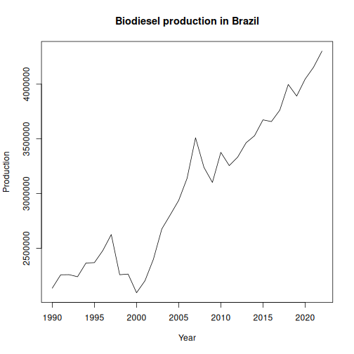

Bioenergy data from FAOSTAT.


Source: http://www.fao.org/faostat/en/#data/BE

##Load series


``` r
library(dalts)
library(daltoolbox)
library(harbinger)
library(tspredit)


## Load series ----------------------
data(bioenergy)
head(bioenergy, 5)
```

```
## $usa_biocons
##    1990    1991    1992    1993    1994    1995    1996    1997    1998    1999    2000    2001    2002    2003    2004    2005 
##  980185 1130112 1384457 1016991 1022212 1233701 1185131 1140607 1286511 1944084 1980411 1719225 1546793 1812682 1969155 2159554 
##    2006    2007    2008    2009    2010    2011    2012    2013    2014    2015    2016    2017    2018    2019    2020    2021 
## 2357847 2439005 2622184 2593940 2761020 2891350 2802703 3082422 3133545 3029560 3065651 3040029 3307871 3392609 3099775 3314215 
##    2022 
## 3405058 
## 
## $usa_bioprod
##    1990    1991    1992    1993    1994    1995    1996    1997    1998    1999    2000    2001    2002    2003    2004    2005 
## 2398810 2459318 2748282 2415635 2457655 2553047 2606313 2534908 2605065 2511560 2551268 2289794 2261187 2465591 2623779 2762492 
##    2006    2007    2008    2009    2010    2011    2012    2013    2014    2015    2016    2017    2018    2019    2020    2021 
## 2802272 2930705 3144067 3107186 3402060 3534919 3442466 3673486 3850448 3705550 3666045 3692296 4023659 4023175 3701303 3910839 
##    2022 
## 4059718 
## 
## $china_biocons
##    1990    1991    1992    1993    1994    1995    1996    1997    1998    1999    2000    2001    2002    2003    2004    2005 
## 2695332 2675688 2632375 2534458 2429341 2364289 2338793 2391201 2472108 2525072 2578863 2626297 2745070 2821172 2870814 2892063 
##    2006    2007    2008    2009    2010    2011    2012    2013    2014    2015    2016    2017    2018    2019    2020    2021 
## 2941219 3066320 3127075 3136488 3166249 3216276 3326491 3441321 3456681 3302891 3283475 3367730 3405324 3353747 3317136 3314097 
##    2022 
## 3303115 
## 
## $china_bioprod
##    1990    1991    1992    1993    1994    1995    1996    1997    1998    1999    2000    2001    2002    2003    2004    2005 
## 2748096 2730832 2689102 2592458 2489436 2458186 2414498 2402958 2404068 2373083 2342968 2306733 2893533 2984958 3043909 3053058 
##    2006    2007    2008    2009    2010    2011    2012    2013    2014    2015    2016    2017    2018    2019    2020    2021 
## 3119233 3288589 3329358 3364633 3383608 3456176 3597434 3764555 3821407 3763835 3786594 3931701 3975963 3920717 3886193 3883855 
##    2022 
## 3874324 
## 
## $germany_biocons
##   1990   1991   1992   1993   1994   1995   1996   1997   1998   1999   2000   2001   2002   2003   2004   2005   2006   2007 
##   3410 118732 110971 111782 112670 112543 113826 171090 183420 182821 200277 215884 230998 305300 340609 387950 485024 531210 
##   2008   2009   2010   2011   2012   2013   2014   2015   2016   2017   2018   2019   2020   2021   2022 
## 554550 528989 629618 584743 635594 632523 568013 566353 555654 566357 582929 586706 597172 628649 650001
```


``` r
serie <- bioenergy$brazil_bioprod
serie
```

```
##    1990    1991    1992    1993    1994    1995    1996    1997    1998    1999    2000    2001    2002    2003    2004    2005 
## 2135065 2257081 2258216 2239328 2364729 2368286 2478873 2625211 2257647 2263689 2092859 2202557 2399202 2676386 2805291 2937378 
##    2006    2007    2008    2009    2010    2011    2012    2013    2014    2015    2016    2017    2018    2019    2020    2021 
## 3140207 3509780 3238897 3101544 3376494 3255430 3333301 3464637 3528712 3673943 3658033 3763143 3997365 3891109 4046108 4154920 
##    2022 
## 4302195
```


``` r
years <- as.numeric(names(serie))
values <- as.numeric(serie)
plot(years, values, type = "l", main = "Biodiesel production in Brazil", ylab = "Production", xlab = "Year")
```



``` r
# Create object ts_data with horizon = 1
ts <- ts_data(values, sw = 1)

# Separate Training and Test samples
samp <- ts_sample(ts, test_size = 5)

#  Input/output projection
io_train <- ts_projection(samp$train)
io_test <- ts_projection(samp$test)
```


``` r
# Create ARIMA and train
model <- ts_arima()
model <- fit(model, x = io_train$input, y = io_train$output)
```


``` r
# Predicting next 5 years
prediction <- predict(model, x = io_test$input[1,], steps_ahead = 5)

# Converting to vector
pred <- as.vector(prediction)
real <- as.vector(io_test$output)

# Evaluate
ev_test <- evaluate(model, real, pred)
ev_test
```

```
## $values
## [1] 3997365 3891109 4046108 4154920 4302195
## 
## $prediction
## [1] 3823442 3883741 3944041 4004340 4064639
## 
## $smape
## [1] 0.03312319
## 
## $mse
## [1] 23965698700
## 
## $R2
## [1] -0.2149682
## 
## $metrics
##           mse      smape         R2
## 1 23965698700 0.03312319 -0.2149682
```
