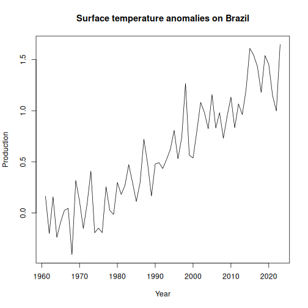

Statistics of surface temperature anomalies on land, based on NASA-GISS GISTEMP data.


Source: https://data.giss.nasa.gov/gistemp/

##Load series


``` r
library(dalts)
library(daltoolbox)
library(harbinger)
library(tspredit)

## Load series ----------------------
data(climate)
head(climate,5)
```

```
## $usa_clima
##   1961   1962   1963   1964   1965   1966   1967   1968   1969   1970   1971   1972   1973   1974   1975   1976   1977   1978 
##  0.003 -0.027  0.425 -0.281 -0.360 -0.212  0.078 -0.079 -0.268 -0.020 -0.411 -0.257 -0.025  0.092 -0.367 -0.120  0.400  0.022 
##   1979   1980   1981   1982   1983   1984   1985   1986   1987   1988   1989   1990   1991   1992   1993   1994   1995   1996 
## -0.337  0.410  0.872 -0.351  0.551 -0.230 -0.028  0.584  0.920  0.483  0.316  0.675  0.529  0.396  0.010  0.472  0.638 -0.005 
##   1997   1998   1999   2000   2001   2002   2003   2004   2005   2006   2007   2008   2009   2010   2011   2012   2013   2014 
##  0.389  1.274  0.756  1.002  0.788  0.953  0.991  0.863  1.154  1.033  1.148  0.219  0.408  0.704  0.543  1.455  0.619  0.506 
##   2015   2016   2017   2018   2019   2020   2021   2022   2023 
##  1.530  2.223  1.434  1.277  1.037  1.332  1.149  1.223  1.212 
## 
## $china_clima
##   1961   1962   1963   1964   1965   1966   1967   1968   1969   1970   1971   1972   1973   1974   1975   1976   1977   1978 
##  0.256 -0.147  0.286 -0.022  0.080  0.186 -0.273 -0.404 -0.207 -0.300  0.040  0.017  0.413 -0.004  0.283 -0.388 -0.052  0.247 
##   1979   1980   1981   1982   1983   1984   1985   1986   1987   1988   1989   1990   1991   1992   1993   1994   1995   1996 
##  0.304  0.259  0.228  0.390  0.135 -0.136 -0.110 -0.029  0.441  0.405  0.432  0.856  0.537  0.145  0.299  0.750  0.596  0.231 
##   1997   1998   1999   2000   2001   2002   2003   2004   2005   2006   2007   2008   2009   2010   2011   2012   2013   2014 
##  0.756  1.290  1.254  0.598  1.063  1.154  0.844  1.132  1.069  1.250  1.553  1.106  1.351  0.983  0.806  0.638  1.087  1.061 
##   2015   2016   2017   2018   2019   2020   2021   2022   2023 
##  1.300  1.331  1.587  1.374  1.410  1.580  1.656  1.853  1.841 
## 
## $germany_clima
##   1961   1962   1963   1964   1965   1966   1967   1968   1969   1970   1971   1972   1973   1974   1975   1976   1977   1978 
##  0.988 -0.751 -1.085 -0.329 -0.813  0.408  0.872  0.207 -0.109 -0.832  0.033 -0.016  0.188  0.317  1.100  0.471  0.284 -0.173 
##   1979   1980   1981   1982   1983   1984   1985   1986   1987   1988   1989   1990   1991   1992   1993   1994   1995   1996 
## -0.639 -0.185  0.297  0.442  1.073 -0.108 -0.797 -0.004 -0.559  0.895  1.493  1.573  0.288  1.230  0.314  1.627  1.309 -0.697 
##   1997   1998   1999   2000   2001   2002   2003   2004   2005   2006   2007   2008   2009   2010   2011   2012   2013   2014 
##  0.561  1.155  1.368  1.765  1.293  1.492  1.261  1.004  1.031  1.263  2.098  1.550  1.287  0.200  1.126  1.354  0.588  2.518 
##   2015   2016   2017   2018   2019   2020   2021   2022   2023 
##  1.670  1.982  1.645  2.385  2.322  2.506  1.315  2.587  2.442 
## 
## $japan_clima
##   1961   1962   1963   1964   1965   1966   1967   1968   1969   1970   1971   1972   1973   1974   1975   1976   1977   1978 
##  0.670  0.126 -0.054  0.260 -0.527  0.014  0.029 -0.501 -0.045 -0.373 -0.328  0.233  0.333 -0.482  0.041 -0.508 -0.154  0.231 
##   1979   1980   1981   1982   1983   1984   1985   1986   1987   1988   1989   1990   1991   1992   1993   1994   1995   1996 
##  0.456 -0.214 -0.641 -0.047  0.099 -0.616  0.118 -0.700  0.318 -0.160  0.558  1.135  0.724  0.326  0.005  0.958  0.342 -0.132 
##   1997   1998   1999   2000   2001   2002   2003   2004   2005   2006   2007   2008   2009   2010   2011   2012   2013   2014 
##  0.449  1.194  0.944  0.624  0.409  0.621  0.312  1.105  0.724  0.374  0.988  0.657  0.793  0.913  0.585  0.381  0.609  0.543 
##   2015   2016   2017   2018   2019   2020   2021   2022   2023 
##  0.817  1.307  0.781  0.908  1.253  1.418  1.253  1.316  1.847 
## 
## $india_clima
##   1961   1962   1963   1964   1965   1966   1967   1968   1969   1970   1971   1972   1973   1974   1975   1976   1977   1978 
## -0.214 -0.526 -0.062  0.002 -0.053  0.308 -0.213 -0.224  0.323  0.061 -0.485  0.019  0.346  0.033 -0.299  0.010  0.162 -0.161 
##   1979   1980   1981   1982   1983   1984   1985   1986   1987   1988   1989   1990   1991   1992   1993   1994   1995   1996 
##  0.299  0.391  0.068 -0.021 -0.165 -0.150  0.179  0.163  0.564  0.479 -0.029 -0.098  0.179  0.017  0.211  0.100  0.224  0.319 
##   1997   1998   1999   2000   2001   2002   2003   2004   2005   2006   2007   2008   2009   2010   2011   2012   2013   2014 
## -0.092  0.588  0.467  0.356  0.479  0.831  0.689  0.570  0.606  0.685  0.636  0.303  1.176  1.159  0.364  0.487  0.445  0.536 
##   2015   2016   2017   2018   2019   2020   2021   2022   2023 
##  0.705  1.077  0.962  0.881  0.813  0.529  0.734  0.784  0.894
```


``` r
serie <- climate$brazil_clima
serie
```

```
##   1961   1962   1963   1964   1965   1966   1967   1968   1969   1970   1971   1972   1973   1974   1975   1976   1977   1978 
##  0.164 -0.201  0.159 -0.238 -0.090  0.026  0.046 -0.408  0.319  0.116 -0.151  0.087  0.410 -0.193 -0.148 -0.192  0.256  0.025 
##   1979   1980   1981   1982   1983   1984   1985   1986   1987   1988   1989   1990   1991   1992   1993   1994   1995   1996 
## -0.014  0.299  0.182  0.269  0.473  0.299  0.112  0.299  0.721  0.480  0.166  0.480  0.492  0.435  0.525  0.623  0.808  0.530 
##   1997   1998   1999   2000   2001   2002   2003   2004   2005   2006   2007   2008   2009   2010   2011   2012   2013   2014 
##  0.738  1.267  0.566  0.538  0.802  1.082  0.983  0.824  1.158  0.831  0.981  0.731  0.946  1.134  0.833  1.067  0.963  1.205 
##   2015   2016   2017   2018   2019   2020   2021   2022   2023 
##  1.610  1.544  1.432  1.179  1.540  1.452  1.149  0.997  1.648
```


``` r
years <- as.numeric(names(serie))
values <- as.numeric(serie)
plot(years, values, type = "l", main = "Surface temperature anomalies on Brazil", ylab = "Production", xlab = "Year")
```



``` r
# Create object ts_data with horizon = 1
ts <- ts_data(values, sw = 1)

# Separate Training and Test samples
samp <- ts_sample(ts, test_size = 5)

#  Input/output projection
io_train <- ts_projection(samp$train)
io_test <- ts_projection(samp$test)
```


``` r
# Create ARIMA and train
model <- ts_arima()
model <- fit(model, x = io_train$input, y = io_train$output)
```


``` r
# Predicting next 5 years
prediction <- predict(model, x = io_test$input[1,], steps_ahead = 5)

# Converting to vector
pred <- as.vector(prediction)
real <- as.vector(io_test$output)

# Evaluate
ev_test <- evaluate(model, real, pred)
ev_test
```

```
## $values
## [1] 1.540 1.452 1.149 0.997 1.648
## 
## $prediction
## [1] 1.373018 1.456547 1.431632 1.446850 1.487066
## 
## $smape
## [1] 0.1615255
## 
## $mse
## [1] 0.06720971
## 
## $R2
## [1] -0.1199422
## 
## $metrics
##          mse     smape         R2
## 1 0.06720971 0.1615255 -0.1199422
```

