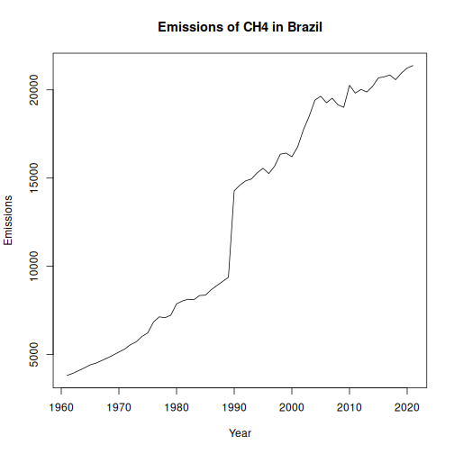

National and global estimates of greenhouse gas emissions data from FAOSTAT.


Source: https://www.fao.org/faostat/en/#data/GT

##Load series


``` r
library(dalts)
library(daltoolbox)
library(harbinger)
library(tspredit)


## Load series ----------------------
data(emissions)
head(emissions, 5)
```

```
## $brazil_ch4
##      1961      1962      1963      1964      1965      1966      1967      1968      1969      1970      1971      1972 
##  3813.622  3932.883  4085.257  4242.363  4410.431  4508.084  4654.017  4805.884  4966.627  5137.261  5310.231  5555.474 
##      1973      1974      1975      1976      1977      1978      1979      1980      1981      1982      1983      1984 
##  5718.889  6024.112  6224.141  6842.508  7134.569  7085.217  7230.840  7873.302  8033.757  8134.718  8104.234  8346.397 
##      1985      1986      1987      1988      1989      1990      1991      1992      1993      1994      1995      1996 
##  8365.077  8668.444  8911.360  9144.477  9378.674 14282.540 14606.136 14845.507 14953.297 15303.754 15554.690 15259.248 
##      1997      1998      1999      2000      2001      2002      2003      2004      2005      2006      2007      2008 
## 15671.286 16353.897 16416.884 16207.496 16765.179 17731.852 18499.044 19419.180 19642.865 19271.923 19527.564 19151.990 
##      2009      2010      2011      2012      2013      2014      2015      2016      2017      2018      2019      2020 
## 19010.070 20260.627 19819.469 20026.547 19879.955 20201.156 20674.783 20742.551 20843.745 20576.626 20952.022 21238.235 
##      2021 
## 21377.897 
## 
## $brazil_co2
##      1990      1991      1992      1993      1994      1995      1996      1997      1998      1999      2000      2001 
## 1264905.9 1274941.3 1277010.6 1287327.1 1298677.6 1315251.5 1340546.4 1356662.2 1368141.6 1375974.4 1385565.4 1454322.4 
##      2002      2003      2004      2005      2006      2007      2008      2009      2010      2011      2012      2013 
## 1450698.0 1441968.5 1459393.3 1467961.4 1467748.8 1483771.7 1506981.0 1484591.1 1540226.4  718509.9  747827.0  783187.4 
##      2014      2015      2016      2017      2018      2019      2020      2021 
##  811879.5  783418.1  889187.2  895167.6  874815.2  867836.8  841617.6  898647.4 
## 
## $brazil_n2o
##     1961     1962     1963     1964     1965     1966     1967     1968     1969     1970     1971     1972     1973     1974 
## 121.8403 125.2463 129.8110 133.7838 139.3563 142.9009 148.0634 153.3704 158.6483 166.1687 171.8227 182.4929 186.8692 198.2945 
##     1975     1976     1977     1978     1979     1980     1981     1982     1983     1984     1985     1986     1987     1988 
## 204.6554 222.6285 235.1703 232.7961 241.0021 261.0950 259.8556 262.9977 259.7932 273.2566 276.5921 286.7920 294.2781 297.8691 
##     1989     1990     1991     1992     1993     1994     1995     1996     1997     1998     1999     2000     2001     2002 
## 307.0334 387.2858 398.3082 405.9292 413.0243 427.3220 434.0533 406.1771 421.9283 449.3400 445.8308 443.9329 477.0474 509.7237 
##     2003     2004     2005     2006     2007     2008     2009     2010     2011     2012     2013     2014     2015     2016 
## 526.0860 561.4570 568.3501 539.1789 607.5350 559.0242 535.0528 633.5498 596.8712 610.9010 598.1931 627.5219 629.7488 621.0285 
##     2017     2018     2019     2020     2021 
## 660.8209 624.7169 666.3200 707.6412 716.1555 
## 
## $canada_ch4
##      1961      1962      1963      1964      1965      1966      1967      1968      1969      1970      1971      1972 
## 1037.4143 1046.9093 1055.1840 1084.1474 1106.9899 1062.8913 1061.4241 1055.7110 1030.4427 1044.7271 1045.4302 1055.4659 
##      1973      1974      1975      1976      1977      1978      1979      1980      1981      1982      1983      1984 
## 1070.1528 1094.3791 1122.6697 1105.6510 1067.2626 1022.1668 1003.7079 1027.7336 1031.9340 1031.1753 1009.8916  995.4737 
##      1985      1986      1987      1988      1989      1990      1991      1992      1993      1994      1995      1996 
##  975.2274  938.8802  910.3648  923.5196  934.6241 3355.5308 3395.2394 3471.5327 3595.2494 3712.3012 3853.7007 4073.0939 
##      1997      1998      1999      2000      2001      2002      2003      2004      2005      2006      2007      2008 
## 4073.1002 4411.7691 4219.0283 4195.3324 4214.8791 4305.7106 4273.3519 4353.6839 4315.4639 4324.3740 4280.8499 4155.3354 
##      2009      2010      2011      2012      2013      2014      2015      2016      2017      2018      2019      2020 
## 4018.7469 3958.6845 3932.2993 4012.0895 4136.4207 4230.7082 4353.3719 4302.1993 4250.3523 4416.0066 4295.7355 4298.1614 
##      2021 
## 4384.5843 
## 
## $canada_co2
##     1990     1991     1992     1993     1994     1995     1996     1997     1998     1999     2000     2001     2002     2003 
## 538415.3 529756.5 545718.6 550542.7 561516.5 574302.3 585266.6 601938.9 613308.0 623080.2 642513.7 870681.1 863396.0 896678.1 
##     2004     2005     2006     2007     2008     2009     2010     2011     2012     2013     2014     2015     2016     2017 
## 898071.0 907143.8 917622.4 917712.7 902572.4 870132.4 862961.1 696850.2 696264.2 698619.0 718507.9 727057.6 624610.4 647802.9 
##     2018     2019     2020     2021 
## 658136.5 645182.6 584857.5 597155.9
```


``` r
serie <- emissions$brazil_ch4
serie
```

```
##      1961      1962      1963      1964      1965      1966      1967      1968      1969      1970      1971      1972 
##  3813.622  3932.883  4085.257  4242.363  4410.431  4508.084  4654.017  4805.884  4966.627  5137.261  5310.231  5555.474 
##      1973      1974      1975      1976      1977      1978      1979      1980      1981      1982      1983      1984 
##  5718.889  6024.112  6224.141  6842.508  7134.569  7085.217  7230.840  7873.302  8033.757  8134.718  8104.234  8346.397 
##      1985      1986      1987      1988      1989      1990      1991      1992      1993      1994      1995      1996 
##  8365.077  8668.444  8911.360  9144.477  9378.674 14282.540 14606.136 14845.507 14953.297 15303.754 15554.690 15259.248 
##      1997      1998      1999      2000      2001      2002      2003      2004      2005      2006      2007      2008 
## 15671.286 16353.897 16416.884 16207.496 16765.179 17731.852 18499.044 19419.180 19642.865 19271.923 19527.564 19151.990 
##      2009      2010      2011      2012      2013      2014      2015      2016      2017      2018      2019      2020 
## 19010.070 20260.627 19819.469 20026.547 19879.955 20201.156 20674.783 20742.551 20843.745 20576.626 20952.022 21238.235 
##      2021 
## 21377.897
```


``` r
years <- as.numeric(names(serie))
values <- as.numeric(serie)
plot(years, values, type = "l", main = "Emissions of CH4 in Brazil", ylab = "Emissions", xlab = "Year")
```



``` r
# Create object ts_data with horizon = 1
ts <- ts_data(values, sw = 1)

# Separate Training and Test samples
samp <- ts_sample(ts, test_size = 5)

#  Input/output projection
io_train <- ts_projection(samp$train)
io_test <- ts_projection(samp$test)
```


``` r
# Create ARIMA and train
model <- ts_arima()
model <- fit(model, x = io_train$input, y = io_train$output)
```


``` r
# Predicting next 5 years
prediction <- predict(model, x = io_test$input[1,], steps_ahead = 5)

# Converting to vector
pred <- as.vector(prediction)
real <- as.vector(io_test$output)

# Evaluate
ev_test <- evaluate(model, real, pred)
ev_test
```

```
## $values
## [1] 20843.75 20576.63 20952.02 21238.24 21377.90
## 
## $prediction
## [1] 21050.35 21358.15 21665.95 21973.75 22281.54
## 
## $smape
## [1] 0.03121544
## 
## $mse
## [1] 504141.6
## 
## $R2
## [1] -5.216313
## 
## $metrics
##        mse      smape        R2
## 1 504141.6 0.03121544 -5.216313
```
