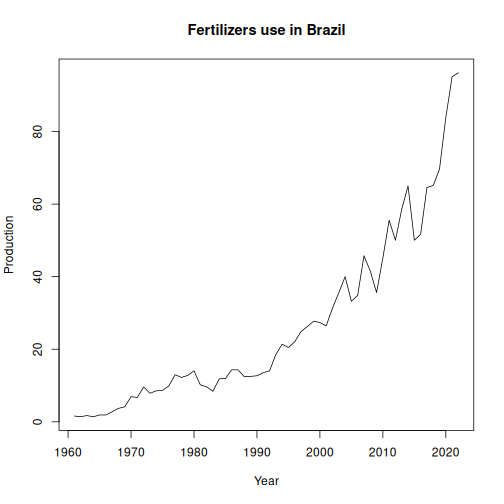

Statistics on agricultural use, production, and trade of chemical and mineral fertilizers.

Source: https://www.fao.org/faostat/en/#data/RFN

##Load series


``` r
library(dalts)
library(daltoolbox)
library(harbinger)
library(tspredit)

## Load series ----------------------
data(fertilizers)
head(fertilizers,5)
```

```
## $usa_n
##  1961  1962  1963  1964  1965  1966  1967  1968  1969  1970  1971  1972  1973  1974  1975  1976  1977  1978  1979  1980  1981 
## 12.96 15.18 16.85 18.34 20.69 23.69 26.91 27.40 27.71 30.14 30.80 31.46 34.11 33.87 37.84 40.76 39.25 39.84 42.56 44.75 43.00 
##  1982  1983  1984  1985  1986  1987  1988  1989  1990  1991  1992  1993  1994  1995  1996  1997  1998  1999  2000  2001  2002 
## 37.24 39.93 43.44 41.21 39.31 40.24 40.84 42.19 43.35 44.04 44.48 47.99 47.39 47.73 49.38 49.67 50.22 50.43 48.09 48.30 49.95 
##  2003  2004  2005  2006  2007  2008  2009  2010  2011  2012  2013  2014  2015  2016  2017  2018  2019  2020  2021  2022 
## 53.81 50.96 49.75 54.50 55.43 50.57 53.98 56.54 59.49 62.14 60.97 59.46 59.39 58.26 57.75 59.72 59.49 60.76 60.16 59.07 
## 
## $usa_p2o5
##  1961  1962  1963  1964  1965  1966  1967  1968  1969  1970  1971  1972  1973  1974  1975  1976  1977  1978  1979  1980  1981 
## 13.63 15.04 16.28 17.45 18.98 21.16 22.61 22.73 21.90 22.44 23.12 23.95 24.47 22.86 23.81 26.36 25.58 25.71 26.18 25.86 24.09 
##  1982  1983  1984  1985  1986  1987  1988  1989  1990  1991  1992  1993  1994  1995  1996  1997  1998  1999  2000  2001  2002 
## 21.07 21.97 22.73 20.89 19.48 19.71 19.91 20.55 20.57 20.34 21.19 22.01 21.99 22.10 22.91 23.24 22.23 21.84 21.80 22.82 22.15 
##  2003  2004  2005  2006  2007  2008  2009  2010  2011  2012  2013  2014  2015  2016  2017  2018  2019  2020  2021  2022 
## 24.91 23.95 23.12 23.60 23.42 17.30 22.95 23.69 23.99 27.02 26.91 24.37 24.75 24.70 24.99 25.31 24.95 25.78 24.35 23.73 
## 
## $usa_k2o
##  1961  1962  1963  1964  1965  1966  1967  1968  1969  1970  1971  1972  1973  1974  1975  1976  1977  1978  1979  1980  1981 
##  9.97 10.99 11.88 12.68 14.00 15.97 17.28 17.21 17.00 17.80 18.44 19.50 21.23 20.41 21.29 24.22 24.50 25.52 26.75 26.94 25.30 
##  1982  1983  1984  1985  1986  1987  1988  1989  1990  1991  1992  1993  1994  1995  1996  1997  1998  1999  2000  2001  2002 
## 22.16 23.27 24.31 22.60 21.18 21.39 21.27 21.99 22.10 21.85 22.37 23.03 22.99 23.08 24.13 24.26 23.19 22.76 22.67 22.74 23.00 
##  2003  2004  2005  2006  2007  2008  2009  2010  2011  2012  2013  2014  2015  2016  2017  2018  2019  2020  2021  2022 
## 25.65 24.04 21.95 23.85 23.13 15.29 22.14 22.69 22.90 25.10 27.11 24.39 25.06 25.32 25.55 25.14 25.43 27.18 25.54 24.84 
## 
## $china_n
##   1961   1962   1963   1964   1965   1966   1967   1968   1969   1970   1971   1972   1973   1974   1975   1976   1977   1978 
##   5.17   7.71   9.29  11.94  17.53  25.66  18.88  20.77  25.60  32.86  32.99  37.91  43.90  37.72  50.07  47.30  70.43  92.51 
##   1979   1980   1981   1982   1983   1984   1985   1986   1987   1988   1989   1990   1991   1992   1993   1994   1995   1996 
## 106.12 120.86 114.25 115.91 122.84 127.88 109.92 106.57 131.18 143.40 144.37 147.94 149.85 154.50 137.55 146.39 181.70 193.06 
##   1997   1998   1999   2000   2001   2002   2003   2004   2005   2006   2007   2008   2009   2010   2011   2012   2013   2014 
## 175.31 174.84 184.43 169.13 170.53 191.23 191.34 198.36 200.41 204.05 208.60 210.60 213.88 219.30 224.93 229.96 232.49 235.15 
##   2015   2016   2017   2018   2019   2020   2021   2022 
## 235.05 233.31 228.11 218.58 208.88 201.34 196.39 191.35 
## 
## $china_p2o5
##   1961   1962   1963   1964   1965   1966   1967   1968   1969   1970   1971   1972   1973   1974   1975   1976   1977   1978 
##   1.41   1.49   2.32   3.74   6.94   9.50   6.39   4.52   7.46   9.26  11.00  12.93  17.34  14.45  15.95  14.83  18.65  13.43 
##   1979   1980   1981   1982   1983   1984   1985   1986   1987   1988   1989   1990   1991   1992   1993   1994   1995   1996 
##  20.43  27.38  29.05  32.85  36.29  34.33  23.86  23.75  35.04  39.99  40.37  44.27  54.66  52.60  42.36  56.00  68.09  62.01 
##   1997   1998   1999   2000   2001   2002   2003   2004   2005   2006   2007   2008   2009   2010   2011   2012   2013   2014 
##  70.87  72.24  68.04  65.77  67.58  78.64  73.93  81.66  86.95  89.77  77.37  80.09  94.93 106.26 102.50 104.08 104.34 101.70 
##   2015   2016   2017   2018   2019   2020   2021   2022 
##  96.95  92.48  90.62  86.45  82.73  80.55  79.38  75.43
```


``` r
serie <- fertilizers$brazil_n
serie
```

```
##  1961  1962  1963  1964  1965  1966  1967  1968  1969  1970  1971  1972  1973  1974  1975  1976  1977  1978  1979  1980  1981 
##  1.58  1.42  1.72  1.38  1.89  1.88  2.77  3.70  4.15  6.93  6.70  9.60  7.86  8.54  8.66  9.88 12.99 12.23 12.78 14.05 10.19 
##  1982  1983  1984  1985  1986  1987  1988  1989  1990  1991  1992  1993  1994  1995  1996  1997  1998  1999  2000  2001  2002 
##  9.64  8.40 11.83 11.95 14.35 14.30 12.43 12.51 12.70 13.55 14.04 18.56 21.39 20.48 22.05 24.88 26.26 27.72 27.36 26.44 31.35 
##  2003  2004  2005  2006  2007  2008  2009  2010  2011  2012  2013  2014  2015  2016  2017  2018  2019  2020  2021  2022 
## 35.54 39.99 33.21 34.84 45.76 41.55 35.63 45.13 55.56 50.02 58.61 65.00 50.04 51.68 64.56 65.12 69.65 83.85 95.08 96.18
```


``` r
years <- as.numeric(names(serie))
values <- as.numeric(serie)
plot(years, values, type = "l", main = "Fertilizers use in Brazil", ylab = "Production", xlab = "Year")
```



``` r
# Create object ts_data with horizon = 1
ts <- ts_data(values, sw = 1)

# Separate Training and Test samples
samp <- ts_sample(ts, test_size = 5)

#  Input/output projection
io_train <- ts_projection(samp$train)
io_test <- ts_projection(samp$test)
```


``` r
# Create ARIMA and train
model <- ts_arima()
model <- fit(model, x = io_train$input, y = io_train$output)
```


``` r
# Predicting next 5 years
prediction <- predict(model, x = io_test$input[1,], steps_ahead = 5)

# Converting to vector
pred <- as.vector(prediction)
real <- as.vector(io_test$output)

# Evaluate
ev_test <- evaluate(model, real, pred)
ev_test
```

```
## $values
## [1] 65.12 69.65 83.85 95.08 96.18
## 
## $prediction
## [1] 66.46263 64.95528 65.24862 66.03006 67.08588
## 
## $smape
## [1] 0.2113409
## 
## $mse
## [1] 412.0442
## 
## $R2
## [1] -1.533987
## 
## $metrics
##        mse     smape        R2
## 1 412.0442 0.2113409 -1.533987
```

