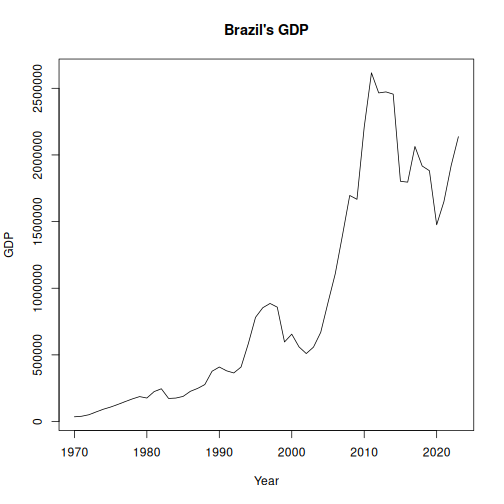

Summary of global and regional trends in GDP and agriculture value.

Source: http://www.fao.org/faostat/en/#data/MK

##Load series


``` r
library(dalts)
library(daltoolbox)
library(harbinger)
library(tspredit)

## Load series ----------------------
data(gdp)
head(gdp,5)
```

```
## $usa_gdp
##     1970     1971     1972     1973     1974     1975     1976     1977     1978     1979     1980     1981     1982     1983 
##  1073303  1164850  1279110  1425376  1545243  1684904  1873412  2081826  2351599  2627333  2857307  3207041  3343789  3634038 
##     1984     1985     1986     1987     1988     1989     1990     1991     1992     1993     1994     1995     1996     1997 
##  4037613  4338979  4579631  4855215  5236438  5641580  5963144  6158129  6520327  6858559  7287236  7639749  8073122  8577552 
##     1998     1999     2000     2001     2002     2003     2004     2005     2006     2007     2008     2009     2010     2011 
##  9062817  9631172 10250952 10581929 10929108 11456450 12217196 13039197 13815583 14474228 14769862 14478067 15048970 15599731 
##     2012     2013     2014     2015     2016     2017     2018     2019     2020     2021     2022     2023 
## 16254000 16880700 17608100 18295000 18804900 19612100 20656500 21521400 21323000 23594000 25744100 27149489 
## 
## $china_gdp
##        1970        1971        1972        1973        1974        1975        1976        1977        1978        1979 
##    96584.14   104464.34   119647.20   146911.41   153959.86   173929.92   167264.81   191228.10   237566.20   287076.89 
##        1980        1981        1982        1983        1984        1985        1986        1987        1988        1989 
##   336047.85   321700.12   317358.77   335791.78   348538.56   346900.41   343123.75   379670.17   469841.20   527782.89 
##        1990        1991        1992        1993        1994        1995        1996        1997        1998        1999 
##   474740.98   506100.81   602324.02   745135.71   706445.44   886183.40  1030644.03  1146222.22  1204743.85  1266319.93 
##        2000        2001        2002        2003        2004        2005        2006        2007        2008        2009 
##  1389774.25  1515665.16  1644277.83  1829912.23  2135090.30  2479691.79  2960522.12  3780360.25  4834648.12  5337330.42 
##        2010        2011        2012        2013        2014        2015        2016        2017        2018        2019 
##  6344068.42  7836902.03  8838004.95  9897700.35 10821985.90 11416003.51 11599244.25 12702146.91 14311827.26 14698122.41 
##        2020        2021        2022        2023 
## 15058028.01 18220337.69 18347051.41 18571020.99 
## 
## $germany_gdp
##      1970      1971      1972      1973      1974      1975      1976      1977      1978      1979      1980      1981 
##  215835.2  249984.8  299796.7  398380.2  445305.0  490625.9  519741.1  600491.4  740474.6  881309.1  950333.6  800458.4 
##      1982      1983      1984      1985      1986      1987      1988      1989      1990      1991      1992      1993 
##  776578.6  770707.8  725107.7  732522.1 1046295.4 1298187.7 1401165.2 1399040.1 1771646.9 1868922.8 2131681.2 2071251.5 
##      1994      1995      1996      1997      1998      1999      2000      2001      2002      2003      2004      2005 
## 2205017.0 2585619.3 2497313.4 2211968.0 2238981.4 2194140.4 1943143.9 1944090.0 2068718.2 2496032.4 2809310.1 2845732.0 
##      2006      2007      2008      2009      2010      2011      2012      2013      2014      2015      2016      2017 
## 2992043.4 3421053.5 3730166.0 3397586.4 3396354.1 3744408.6 3527344.9 3732743.4 3883920.2 3356235.7 3467498.0 3690849.2 
##      2018      2019      2020      2021      2022      2023 
## 3974443.4 3889177.6 3887727.2 4278503.9 4076923.6 4394652.1 
## 
## $japan_gdp
##      1970      1971      1972      1973      1974      1975      1976      1977      1978      1979      1980      1981 
##  212609.2  240151.8  318031.3  432082.7  479626.0  521541.9  586161.9  721411.8 1013612.3 1055012.1 1105385.8 1218988.8 
##      1982      1983      1984      1985      1986      1987      1988      1989      1990      1991      1992      1993 
## 1134518.2 1243323.8 1318381.6 1398892.5 2078952.9 2532808.6 3071683.8 3054913.8 3132817.7 3584421.0 3908808.4 4454144.4 
##      1994      1995      1996      1997      1998      1999      2000      2001      2002      2003      2004      2005 
## 4998797.3 5545564.9 4923393.5 4492450.0 4098362.7 4635982.0 4968359.2 4374710.0 4182845.4 4519563.0 4893135.5 4831466.5 
##      2006      2007      2008      2009      2010      2011      2012      2013      2014      2015      2016      2017 
## 4601662.7 4579749.8 5106679.4 5289493.7 5759071.8 6233147.2 6272363.0 5212328.2 4896994.4 4444930.7 5003677.6 4930837.4 
##      2018      2019      2020      2021      2022      2023 
## 5040880.9 5117993.9 5048789.6 5005536.7 4232173.9 4166936.1 
## 
## $india_gdp
##       1970       1971       1972       1973       1974       1975       1976       1977       1978       1979       1980 
##   62422.48   66898.48   72744.18   86851.36   97977.99  101735.37  102463.68  119039.44  137524.18  152061.73  187032.82 
##       1981       1982       1983       1984       1985       1986       1987       1988       1989       1990       1991 
##  199543.86  204391.19  222870.09  221946.23  230042.72  252454.32  279184.28  308515.07  304013.81  329139.43  291200.36 
##       1992       1993       1994       1995       1996       1997       1998       1999       2000       2001       2002 
##  293692.99  287273.82  327525.50  371782.72  393646.93  425545.04  429550.24  461791.15  476148.03  490658.80  512774.62 
##       2003       2004       2005       2006       2007       2008       2009       2010       2011       2012       2013 
##  599470.43  703128.96  823611.58  939066.42 1184724.49 1267470.12 1315230.23 1669619.79 1871918.01 1860877.24 1917053.70 
##       2014       2015       2016       2017       2018       2019       2020       2021       2022       2023 
## 2042939.29 2146758.60 2290590.96 2624329.04 2763196.67 2854814.21 2676119.16 3175276.38 3465541.45 3695362.77
```


``` r
serie <- gdp$brazil_gdp
serie
```

```
##       1970       1971       1972       1973       1974       1975       1976       1977       1978       1979       1980 
##   35379.87   39519.79   50865.28   72012.18   92323.58  108563.23  128345.43  149375.89  169602.61  186976.06  176173.67 
##       1981       1982       1983       1984       1985       1986       1987       1988       1989       1990       1991 
##  224381.53  245733.81  173009.24  175885.26  188347.15  226408.11  248287.20  277346.06  377262.51  408823.14  380373.41 
##       1992       1993       1994       1995       1996       1997       1998       1999       2000       2001       2002 
##  364362.75  408861.90  583242.23  781735.87  853644.15  885685.14  857857.03  596883.52  655448.15  559983.50  509795.18 
##       2003       2004       2005       2006       2007       2008       2009       2010       2011       2012       2013 
##  558233.60  669289.25  891634.03 1107626.71 1397114.28 1695855.34 1666996.12 2208838.11 2616156.61 2465228.29 2472819.36 
##       2014       2015       2016       2017       2018       2019       2020       2021       2022       2023 
## 2456043.77 1802212.00 1795693.27 2063514.69 1916933.71 1881458.56 1476107.29 1649622.89 1920095.48 2136919.78
```


``` r
years <- as.numeric(names(serie))
values <- as.numeric(serie)
plot(years, values, type = "l", main = "Brazil's GDP", ylab = "GDP", xlab = "Year")
```



``` r
# Create object ts_data with horizon = 1
ts <- ts_data(values, sw = 1)

# Separate Training and Test samples
samp <- ts_sample(ts, test_size = 5)

#  Input/output projection
io_train <- ts_projection(samp$train)
io_test <- ts_projection(samp$test)
```


``` r
# Create ARIMA and train
model <- ts_arima()
model <- fit(model, x = io_train$input, y = io_train$output)
```


``` r
# Predicting next 5 years
prediction <- predict(model, x = io_test$input[1,], steps_ahead = 5)

# Converting to vector
pred <- as.vector(prediction)
real <- as.vector(io_test$output)

# Evaluate
ev_test <- evaluate(model, real, pred)
ev_test
```

```
## $values
## [1] 1881459 1476107 1649623 1920095 2136920
## 
## $prediction
## [1] 1869257 1884512 1879631 1881193 1880693
## 
## $smape
## [1] 0.1055847
## 
## $mse
## [1] 57402516613
## 
## $R2
## [1] -0.09853415
## 
## $metrics
##           mse     smape          R2
## 1 57402516613 0.1055847 -0.09853415
```

