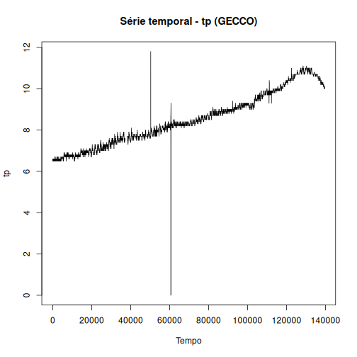

Data collection for water quality monitoring

Source: https://www.spotseven.de/gecco/gecco-challenge


## Load series

``` r
library(dalts)
library(daltoolbox)
library(harbinger)
library(tspredit)

## Load series ----------------------
data(gecco)
gecco$gecco
```

```
##      tp   cl   ph redox leit trueb  cl_2   fm fm_2 event
## 1   6.5 0.17 8.36   749  211 0.011 0.118 1677  695     0
## 2   6.5 0.17 8.36   749  211 0.011 0.118 1561  696     0
## 3   6.5 0.17 8.35   749  211 0.011 0.117 1581  696     0
## 4   6.5 0.17 8.35   749  211 0.011 0.118 1579  693     0
## 5   6.5 0.17 8.35   749  211 0.011 0.118 1567  689     0
## 6   6.5 0.17 8.35   749  211 0.012 0.118 1553  689     0
## 7   6.5 0.17 8.35   749  211 0.011 0.118 1552  695     0
## 8   6.5 0.17 8.35   749  211 0.011 0.118 1603  694     0
## 9   6.5 0.17 8.34   749  211 0.011 0.120 1559  700     0
## 10  6.5 0.17 8.34   749  211 0.011 0.118 1604  690     0
## 11  6.5 0.17 8.34   749  211 0.011 0.118 1570  696     0
## 12  6.5 0.17 8.34   749  211 0.011 0.120 1550  699     0
## 13  6.5 0.17 8.34   749  211 0.011 0.118 1642  694     0
## 14  6.6 0.17 8.34   749  211 0.011 0.118 1547  695     0
## 15  6.5 0.17 8.34   749  211 0.011 0.120 1587  696     0
## 16  6.5 0.17 8.34   749  211 0.011 0.117 1616  696     0
## 17  6.5 0.17 8.34   749  211 0.015 0.118 1540  699     0
## 18  6.6 0.17 8.34   749  211 0.012 0.121 1615  694     0
## 19  6.6 0.17 8.34   749  211 0.011 0.118 1517  700     0
## 20  6.5 0.17 8.34   749  211 0.012 0.120 1609  695     0
## 21  6.6 0.18 8.35   749  211 0.011 0.118 1546  693     0
## 22  6.5 0.18 8.35   749  211 0.011 0.120 1572  696     0
## 23  6.6 0.18 8.34   749  211 0.011 0.118 1597  687     0
## 24  6.5 0.18 8.34   749  211 0.011 0.118 1553  699     0
## 25  6.5 0.18 8.35   749  211 0.011 0.118 1598  689     0
## 26  6.5 0.18 8.35   749  211 0.011 0.118 1614  694     0
## 27  6.5 0.18 8.35   749  211 0.011 0.117 1603  694     0
## 28  6.6 0.18 8.36   749  211 0.011 0.118 1575  696     0
## 29  6.6 0.18 8.36   749  211 0.013 0.118 1582  701     0
## 30  6.5 0.18 8.36   749  211 0.011 0.117 1553  704     0
## 31  6.6 0.18 8.36   749  211 0.011 0.117 1555  700     0
## 32  6.6 0.18 8.37   749  211 0.011 0.118 1545  695     0
## 33  6.6 0.17 8.37   749  211 0.011 0.118 1599  696     0
## 34  6.5 0.17 8.37   749  211 0.010 0.118 1581  694     0
## 35  6.5 0.18 8.38   749  211 0.011 0.116 1581  700     0
## 36  6.5 0.17 8.38   749  211 0.010 0.117 1579  696     0
## 37  6.5 0.18 8.37   749  211 0.010 0.114 1572  689     0
## 38  6.5 0.17 8.38   749  211 0.010 0.116 1552  693     0
## 39  6.5 0.17 8.38   748  211 0.010 0.117 1593  689     0
## 40  6.6 0.17 8.38   749  211 0.010 0.117 1626  688     0
## 41  6.5 0.17 8.39   748  211 0.010 0.116 1609  694     0
## 42  6.5 0.17 8.39   749  211 0.010 0.118 1575  688     0
## 43  6.6 0.17 8.39   749  211 0.010 0.117 1555  694     0
## 44  6.5 0.17 8.39   748  211 0.010 0.118 1550  699     0
## 45  6.5 0.17 8.39   749  211 0.010 0.114 1590  690     0
## 46  6.5 0.17 8.39   748  211 0.010 0.116 1590  695     0
## 47  6.5 0.17 8.39   748  211 0.010 0.117 1575  695     0
## 48  6.5 0.17 8.39   749  207 0.010 0.116 1609  688     0
## 49  6.6 0.17 8.39   749  207 0.011 0.116 1601  696     0
## 50  6.5 0.17 8.39   747  207 0.011 0.117 1653  699     0
## 51  6.5 0.17 8.39   749  207 0.010 0.117 1663  694     0
## 52  6.5 0.17 8.39   749  207 0.010 0.114 1659  693     0
## 53  6.5 0.17 8.39   749  207 0.010 0.117 1651  695     0
## 54  6.5 0.17 8.39   748  207 0.010 0.117 1638  699     0
## 55  6.5 0.17 8.38   748  207 0.010 0.118 1642  695     0
## 56  6.5 0.17 8.38   749  207 0.010 0.117 1604  696     0
## 57  6.6 0.17 8.38   748  205 0.010 0.118 1645  699     0
## 58  6.6 0.17 8.38   748  205 0.010 0.118 1626  696     0
## 59  6.5 0.17 8.37   749  207 0.011 0.117 1645  693     0
## 60  6.6 0.17 8.38   749  206 0.011 0.118 1715  694     0
## 61  6.6 0.17 8.37   749  205 0.011 0.118 1694  695     0
## 62  6.5 0.17 8.36   749  205 0.011 0.118 1732  696     0
## 63  6.5 0.17 8.36   749  207 0.011 0.118 1686  695     0
## 64  6.5 0.17 8.36   750  207 0.010 0.118 1649  694     0
## 65  6.5 0.17 8.36   749  207 0.011 0.118 1668  701     0
## 66  6.6 0.17 8.36   749  207 0.010 0.118 1656  690     0
## 67  6.6 0.17 8.36   749  207 0.011 0.117 1678  701     0
## 68  6.5 0.17 8.36   749  207 0.010 0.118 1663  694     0
## 69  6.5 0.17 8.35   749  207 0.010 0.118 1671  693     0
## 70  6.5 0.17 8.35   749  207 0.011 0.118 1637  695     0
## 71  6.5 0.17 8.36   749  207 0.010 0.117 1616  688     0
## 72  6.5 0.17 8.35   749  207 0.010 0.118 1609  689     0
## 73  6.6 0.17 8.35   749  207 0.010 0.118 1679  694     0
## 74  6.6 0.17 8.35   749  207 0.010 0.118 1650  689     0
## 75  6.5 0.17 8.35   749  207 0.010 0.118 1677  689     0
## 76  6.6 0.17 8.35   750  207 0.010 0.118 1677  688     0
## 77  6.5 0.17 8.35   749  207 0.011 0.117 1688  690     0
## 78  6.6 0.16 8.35   750  207 0.011 0.116 1689  684     0
## 79  6.5 0.16 8.35   749  207 0.011 0.118 1660  696     0
## 80  6.5 0.16 8.35   750  207 0.011 0.116 1712  693     0
## 81  6.5 0.16 8.35   749  207 0.010 0.116 1685  693     0
## 82  6.5 0.16 8.35   750  207 0.010 0.116 1707  687     0
## 83  6.6 0.16 8.35   749  207 0.010 0.118 1718  689     0
## 84  6.5 0.17 8.35   749  207 0.010 0.118 1684  687     0
## 85  6.5 0.17 8.35   749  207 0.010 0.118 1682  690     0
## 86  6.5 0.17 8.35   749  207 0.010 0.114 1662  696     0
## 87  6.6 0.16 8.35   749  207 0.010 0.118 1680  690     0
## 88  6.5 0.17 8.36   749  207 0.010 0.118 1692  689     0
## 89  6.5 0.17 8.35   749  207 0.010 0.118 1601  694     0
## 90  6.5 0.17 8.35   749  207 0.010 0.118 1638  695     0
## 91  6.5 0.17 8.35   749  207 0.010 0.118 1640  694     0
## 92  6.5 0.16 8.35   749  207 0.010 0.118 1599  700     0
## 93  6.5 0.17 8.35   749  207 0.010 0.118 1625  693     0
## 94  6.6 0.17 8.35   749  207 0.016 0.118 1637  690     0
## 95  6.6 0.17 8.35   749  207 0.013 0.118 1640  693     0
## 96  6.5 0.17 8.35   749  207 0.011 0.118 1564  695     0
## 97  6.6 0.17 8.35   749  207 0.011 0.120 1503  695     0
## 98  6.5 0.17 8.35   749  207 0.010 0.118 1446  696     0
## 99  6.6 0.17 8.34   749  205 0.010 0.116 1483  687     0
## 100 6.5 0.17 8.35   749  205 0.011 0.118 1475  688     0
##  [ reached 'max' / getOption("max.print") -- omitted 139466 rows ]
```


``` r
serie <- gecco$gecco$tp
eventos_rotulados <- gecco$gecco$event
head(serie,5)
```

```
## [1] 6.5 6.5 6.5 6.5 6.5
```


``` r
plot(serie, type = "l", main = "Série temporal - tp (GECCO)", xlab = "Tempo", ylab = "tp")
```




``` r
# Create object ts_data with horizon = 1
ts <- ts_data(serie, sw = 1)

# Separate Training and Test samples
samp <- ts_sample(ts, test_size = 500)

#  Input/output projection
io_train <- ts_projection(samp$train)
io_test <- ts_projection(samp$test)
```


``` r
# Create ARIMA and train
model <- ts_arima()
model <- fit(model, x = io_train$input, y = io_train$output)
```


``` r
# Predicting next 500 steps
prediction <- predict(model, x = io_test$input[1,], steps_ahead = 500)

# Converting to vector
pred <- as.vector(prediction)
real <- as.vector(io_test$output)

# Evaluate
ev_test <- evaluate(model, real, pred)
ev_test
```

```
## $values
##   [1] 10.2 10.2 10.1 10.2 10.2 10.2 10.2 10.2 10.2 10.2 10.2 10.2 10.2 10.2 10.2 10.2 10.2 10.2 10.2 10.1 10.1 10.1 10.1 10.1
##  [25] 10.1 10.1 10.1 10.1 10.2 10.1 10.1 10.2 10.2 10.1 10.2 10.2 10.1 10.2 10.1 10.2 10.2 10.1 10.2 10.1 10.2 10.2 10.2 10.2
##  [49] 10.2 10.2 10.2 10.2 10.1 10.2 10.1 10.2 10.1 10.2 10.2 10.1 10.1 10.1 10.1 10.1 10.1 10.2 10.1 10.1 10.1 10.1 10.1 10.1
##  [73] 10.1 10.1 10.1 10.1 10.1 10.1 10.1 10.1 10.1 10.1 10.1 10.1 10.1 10.1 10.1 10.1 10.1 10.1 10.1 10.1 10.1 10.1 10.1 10.1
##  [97] 10.1 10.1 10.1 10.1 10.1 10.1 10.1 10.1 10.1 10.1 10.1 10.1 10.1 10.1 10.1 10.1 10.1 10.1 10.1 10.1 10.1 10.1 10.1 10.1
## [121] 10.1 10.1 10.1 10.1 10.1 10.1 10.1 10.1 10.1 10.1 10.1 10.1 10.1 10.1 10.1 10.1 10.1 10.1 10.1 10.1 10.1 10.1 10.1 10.1
## [145] 10.1 10.1 10.1 10.1 10.1 10.1 10.1 10.1 10.1 10.1 10.1 10.1 10.1 10.1 10.1 10.1 10.1 10.1 10.1 10.1 10.1 10.1 10.1 10.1
## [169] 10.1 10.1 10.1 10.1 10.1 10.1 10.1 10.1 10.1 10.1 10.1 10.1 10.1 10.1 10.1 10.1 10.1 10.1 10.1 10.1 10.1 10.0 10.1 10.1
## [193] 10.1 10.1 10.1 10.1 10.1 10.1 10.1 10.1 10.1 10.1 10.1 10.1 10.1 10.1 10.1 10.1 10.1 10.1 10.1 10.1 10.1 10.1 10.1 10.0
## [217] 10.1 10.1 10.1 10.1 10.1 10.1 10.1 10.1 10.1 10.1 10.1 10.1 10.1 10.1 10.1 10.1 10.1 10.1 10.1 10.1 10.1 10.1 10.1 10.1
## [241] 10.1 10.1 10.0 10.1 10.1 10.1 10.1 10.1 10.1 10.1 10.1 10.1 10.1 10.1 10.1 10.1 10.1 10.1 10.1 10.1 10.1 10.1 10.1 10.1
## [265] 10.1 10.1 10.1 10.1 10.1 10.1 10.1 10.1 10.1 10.1 10.1 10.1 10.1 10.1 10.1 10.1 10.1 10.1 10.1 10.1 10.1 10.1 10.1 10.1
## [289] 10.1 10.1 10.1 10.1 10.1 10.1 10.1 10.1 10.1 10.1 10.1 10.1 10.1 10.1 10.1 10.1 10.1 10.1 10.1 10.1 10.1 10.1 10.1 10.1
## [313] 10.1 10.1 10.1 10.1 10.1 10.1 10.1 10.1 10.1 10.1 10.1 10.1 10.1 10.1 10.1 10.1 10.1 10.1 10.1 10.1 10.1 10.1 10.1 10.1
## [337] 10.1 10.1 10.1 10.1 10.1 10.0 10.1 10.1 10.1 10.1 10.1 10.1 10.1 10.1 10.1 10.1 10.1 10.1 10.1 10.1 10.1 10.1 10.1 10.1
## [361] 10.1 10.1 10.1 10.1 10.1 10.1 10.1 10.1 10.1 10.1 10.1 10.1 10.1 10.1 10.1 10.1 10.1 10.1 10.1 10.1 10.1 10.1 10.1 10.1
## [385] 10.1 10.1 10.1 10.1 10.1 10.1 10.1 10.1 10.0 10.1 10.1 10.0 10.1 10.1 10.1 10.1 10.1 10.1 10.1 10.1 10.0 10.0 10.0 10.0
## [409] 10.0 10.0 10.0 10.0 10.0 10.1 10.1 10.1 10.0 10.1 10.0 10.1 10.1 10.0 10.1 10.1 10.1 10.1 10.1 10.1 10.1 10.1 10.1 10.0
## [433] 10.0 10.0 10.0 10.0 10.1 10.1 10.1 10.0 10.1 10.0 10.0 10.0 10.1 10.1 10.1 10.1 10.1 10.0 10.0 10.0 10.0 10.0 10.0 10.0
## [457] 10.0 10.0 10.0 10.0 10.0 10.0 10.0 10.0 10.0 10.0 10.0 10.0 10.0 10.0 10.0 10.0 10.0 10.0 10.0 10.0 10.0 10.0 10.0 10.0
## [481] 10.0 10.0 10.0 10.0 10.0 10.0 10.0 10.1 10.1 10.0 10.1 10.1 10.1 10.1 10.1 10.1 10.1 10.1 10.1 10.1
## 
## $prediction
##   [1] 10.19102 10.18783 10.18619 10.18575 10.18575 10.18575 10.18575 10.18575 10.18575 10.18575 10.18575 10.18575 10.18575
##  [14] 10.18575 10.18575 10.18575 10.18575 10.18575 10.18575 10.18575 10.18575 10.18575 10.18575 10.18575 10.18575 10.18575
##  [27] 10.18575 10.18575 10.18575 10.18575 10.18575 10.18575 10.18575 10.18575 10.18575 10.18575 10.18575 10.18575 10.18575
##  [40] 10.18575 10.18575 10.18575 10.18575 10.18575 10.18575 10.18575 10.18575 10.18575 10.18575 10.18575 10.18575 10.18575
##  [53] 10.18575 10.18575 10.18575 10.18575 10.18575 10.18575 10.18575 10.18575 10.18575 10.18575 10.18575 10.18575 10.18575
##  [66] 10.18575 10.18575 10.18575 10.18575 10.18575 10.18575 10.18575 10.18575 10.18575 10.18575 10.18575 10.18575 10.18575
##  [79] 10.18575 10.18575 10.18575 10.18575 10.18575 10.18575 10.18575 10.18575 10.18575 10.18575 10.18575 10.18575 10.18575
##  [92] 10.18575 10.18575 10.18575 10.18575 10.18575 10.18575 10.18575 10.18575 10.18575 10.18575 10.18575 10.18575 10.18575
## [105] 10.18575 10.18575 10.18575 10.18575 10.18575 10.18575 10.18575 10.18575 10.18575 10.18575 10.18575 10.18575 10.18575
## [118] 10.18575 10.18575 10.18575 10.18575 10.18575 10.18575 10.18575 10.18575 10.18575 10.18575 10.18575 10.18575 10.18575
## [131] 10.18575 10.18575 10.18575 10.18575 10.18575 10.18575 10.18575 10.18575 10.18575 10.18575 10.18575 10.18575 10.18575
## [144] 10.18575 10.18575 10.18575 10.18575 10.18575 10.18575 10.18575 10.18575 10.18575 10.18575 10.18575 10.18575 10.18575
## [157] 10.18575 10.18575 10.18575 10.18575 10.18575 10.18575 10.18575 10.18575 10.18575 10.18575 10.18575 10.18575 10.18575
## [170] 10.18575 10.18575 10.18575 10.18575 10.18575 10.18575 10.18575 10.18575 10.18575 10.18575 10.18575 10.18575 10.18575
## [183] 10.18575 10.18575 10.18575 10.18575 10.18575 10.18575 10.18575 10.18575 10.18575 10.18575 10.18575 10.18575 10.18575
## [196] 10.18575 10.18575 10.18575 10.18575 10.18575 10.18575 10.18575 10.18575 10.18575 10.18575 10.18575 10.18575 10.18575
## [209] 10.18575 10.18575 10.18575 10.18575 10.18575 10.18575 10.18575 10.18575 10.18575 10.18575 10.18575 10.18575 10.18575
## [222] 10.18575 10.18575 10.18575 10.18575 10.18575 10.18575 10.18575 10.18575 10.18575 10.18575 10.18575 10.18575 10.18575
## [235] 10.18575 10.18575 10.18575 10.18575 10.18575 10.18575 10.18575 10.18575 10.18575 10.18575 10.18575 10.18575 10.18575
## [248] 10.18575 10.18575 10.18575 10.18575 10.18575 10.18575 10.18575 10.18575 10.18575 10.18575 10.18575 10.18575 10.18575
## [261] 10.18575 10.18575 10.18575 10.18575 10.18575 10.18575 10.18575 10.18575 10.18575 10.18575 10.18575 10.18575 10.18575
## [274] 10.18575 10.18575 10.18575 10.18575 10.18575 10.18575 10.18575 10.18575 10.18575 10.18575 10.18575 10.18575 10.18575
## [287] 10.18575 10.18575 10.18575 10.18575 10.18575 10.18575 10.18575 10.18575 10.18575 10.18575 10.18575 10.18575 10.18575
## [300] 10.18575 10.18575 10.18575 10.18575 10.18575 10.18575 10.18575 10.18575 10.18575 10.18575 10.18575 10.18575 10.18575
## [313] 10.18575 10.18575 10.18575 10.18575 10.18575 10.18575 10.18575 10.18575 10.18575 10.18575 10.18575 10.18575 10.18575
## [326] 10.18575 10.18575 10.18575 10.18575 10.18575 10.18575 10.18575 10.18575 10.18575 10.18575 10.18575 10.18575 10.18575
## [339] 10.18575 10.18575 10.18575 10.18575 10.18575 10.18575 10.18575 10.18575 10.18575 10.18575 10.18575 10.18575 10.18575
## [352] 10.18575 10.18575 10.18575 10.18575 10.18575 10.18575 10.18575 10.18575 10.18575 10.18575 10.18575 10.18575 10.18575
## [365] 10.18575 10.18575 10.18575 10.18575 10.18575 10.18575 10.18575 10.18575 10.18575 10.18575 10.18575 10.18575 10.18575
## [378] 10.18575 10.18575 10.18575 10.18575 10.18575 10.18575 10.18575 10.18575 10.18575 10.18575 10.18575 10.18575 10.18575
## [391] 10.18575 10.18575 10.18575 10.18575 10.18575 10.18575 10.18575 10.18575 10.18575 10.18575 10.18575 10.18575 10.18575
## [404] 10.18575 10.18575 10.18575 10.18575 10.18575 10.18575 10.18575 10.18575 10.18575 10.18575 10.18575 10.18575 10.18575
## [417] 10.18575 10.18575 10.18575 10.18575 10.18575 10.18575 10.18575 10.18575 10.18575 10.18575 10.18575 10.18575 10.18575
## [430] 10.18575 10.18575 10.18575 10.18575 10.18575 10.18575 10.18575 10.18575 10.18575 10.18575 10.18575 10.18575 10.18575
## [443] 10.18575 10.18575 10.18575 10.18575 10.18575 10.18575 10.18575 10.18575 10.18575 10.18575 10.18575 10.18575 10.18575
## [456] 10.18575 10.18575 10.18575 10.18575 10.18575 10.18575 10.18575 10.18575 10.18575 10.18575 10.18575 10.18575 10.18575
## [469] 10.18575 10.18575 10.18575 10.18575 10.18575 10.18575 10.18575 10.18575 10.18575 10.18575 10.18575 10.18575 10.18575
## [482] 10.18575 10.18575 10.18575 10.18575 10.18575 10.18575 10.18575 10.18575 10.18575 10.18575 10.18575 10.18575 10.18575
## [495] 10.18575 10.18575 10.18575 10.18575 10.18575 10.18575
## 
## $smape
## [1] 0.009201536
## 
## $mse
## [1] 0.01036421
## 
## $R2
## [1] -3.951937
## 
## $metrics
##          mse       smape        R2
## 1 0.01036421 0.009201536 -3.951937
```


