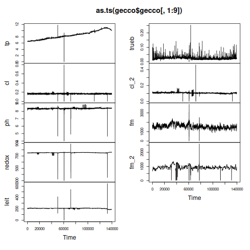
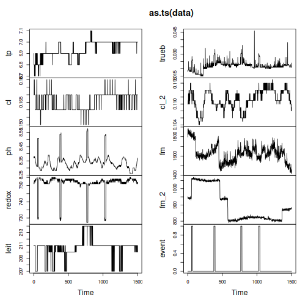
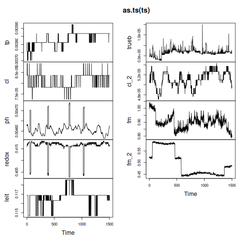
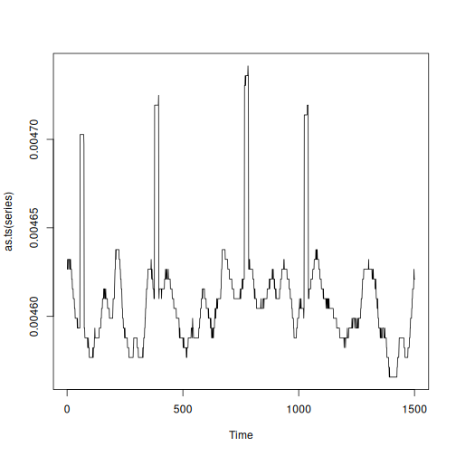
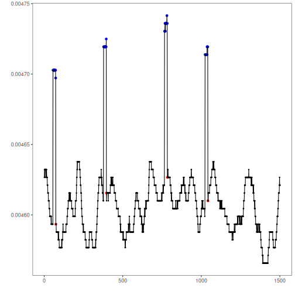

Data collection for water quality monitoring

* Multivariate series with labeled anomalies.
* Recommended use: multivariate or univariate event detection

Source: https://www.spotseven.de/gecco/gecco-challenge


## Load series

``` r
library(dalevents)
library(daltoolbox)
library(harbinger)


## Load series ----------------------
data(gecco)
plot(as.ts(gecco$gecco[,1:9]))
```



Gecco recommended sample: One day with anomalie


``` r
data <- gecco$gecco
data <- data[16500:18000,]
plot(as.ts(data))
```



## Preprocessing

* Normalize data


``` r
ts <- data[,1:9]

preproc <- ts_norm_gminmax()
preproc <- fit(preproc, ts)
ts <- transform(preproc, ts)

head(ts)
```

```
##                tp           cl          ph     redox      leit         trueb         cl_2
## 16500 0.003812228 8.365739e-05 0.004626641 0.4160603 0.1168882  0.000000e+00 5.041604e-05
## 16501 0.003756826 8.365739e-05 0.004632182 0.4160603 0.1168882  0.000000e+00 5.041604e-05
## 16502 0.003756826 8.365739e-05 0.004632182 0.4160603 0.1168882 -5.540225e-07 5.041604e-05
## 16503 0.003756826 8.365739e-05 0.004626641 0.4166144 0.1168882 -5.540225e-07 5.041604e-05
## 16504 0.003756826 8.365739e-05 0.004632182 0.4166144 0.1168882  0.000000e+00 5.041604e-05
## 16505 0.003756826 8.919761e-05 0.004632182 0.4166144 0.1168882  0.000000e+00 5.097007e-05
##              fm      fm_2
## 16500 0.9950138 0.5268648
## 16501 1.0409977 0.5229867
## 16502 1.0238230 0.5218786
## 16503 1.0171747 0.5224326
## 16504 1.0232689 0.5202166
## 16505 1.0088644 0.5196625
```

``` r
plot(as.ts(ts))
```




## Univariate series selection
Select the desired variable directly from preprocessed data.


``` r
series <- ts$ph
plot(as.ts(series))
```



## Event detection experiment

Creating a data frame to organize experiment results.


``` r
#Experiments results organization
experiment <- data.frame(method="hanr_arima",
                         dataset="Gecco",
                         series="ph",
                         elapsed_time_fit=0,
                         elapsed_time_detection=0,
                         accuracy=0,
                         precision=0,
                         recall=0,
                         F1=0)

head(experiment)
```

```
##       method dataset series elapsed_time_fit elapsed_time_detection accuracy precision recall
## 1 hanr_arima   Gecco     ph                0                      0        0         0      0
##   F1
## 1  0
```
Detection steps

``` r
#Establishing arima method
model <- hanr_arima()
```


``` r
#Fitting the model
s <- Sys.time()
model <- fit(model, series)
t_fit <- Sys.time()-s
```


``` r
#Making detections
s <- Sys.time()
detection <- detect(model, series)
t_det <- Sys.time()-s
```


## Results analysis


``` r
#Filtering detected events
print(detection |> dplyr::filter(event==TRUE))
```

```
##    idx event    type
## 1   56  TRUE anomaly
## 2   74  TRUE anomaly
## 3  378  TRUE anomaly
## 4  396  TRUE anomaly
## 5  766  TRUE anomaly
## 6  784  TRUE anomaly
## 7 1024  TRUE anomaly
## 8 1042  TRUE anomaly
```

Visual analysis

``` r
#Ploting the results
grf <- har_plot(model, series, detection, data$event)
plot(grf)
```



Evaluate metrics

``` r
#Evaluating the detection metrics
ev <- evaluate(model, detection$event, data$event)
print(ev$confMatrix)
```

```
##           event      
## detection TRUE  FALSE
## TRUE      4     4    
## FALSE     68    1425
```

Recording experiment results

``` r
#Experiment update
#Time
experiment$elapsed_time_fit[1] <- as.numeric(t_fit)*60
experiment$elapsed_time_detection[1] <- as.numeric(t_det)*60

#Metrics
experiment$accuracy[1] <- ev$accuracy
experiment$precision[1] <- ev$precision
experiment$recall[1] <- ev$recall
experiment$F1[1] <- ev$F1

print(experiment)
```

```
##       method dataset series elapsed_time_fit elapsed_time_detection accuracy precision
## 1 hanr_arima   Gecco     ph         1.408968              0.1267147 0.952032       0.5
##       recall  F1
## 1 0.05555556 0.1
```

### Add new series to experiment 
Repeat detection steps

* Add new rows to the `experiment` data frame
* Run detection steps (create model, fit and detect) for the new series
* Update `experiment` with the new series result
  * Repeated steps for didactic purposes
  * WARNING: In real experimental situations, variable selection and repetition of detection steps should be encapsulated in a loop or function

### Experiment record
The retain experiments data record results

* Save detection results: Save `detection` object after detection of each series
* Save experiment: Save `experiment` object after finishing the complete experiment
