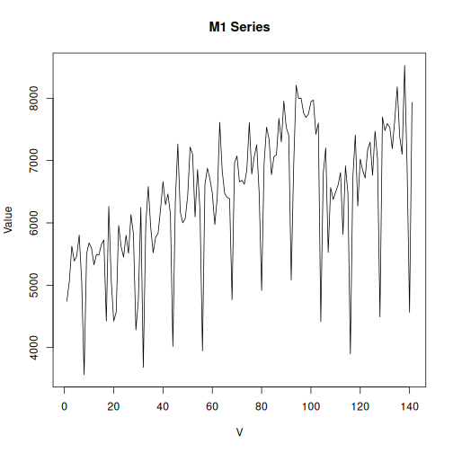

Time series data from the first Makridakis forecasting competition (M1), held in 1982.

Source: https://onlinelibrary.wiley.com/doi/10.1002/for.3980010202

##Load series


``` r
library(dalts)
library(daltoolbox)
library(harbinger)
library(tspredit)

## Load series ----------------------
data(m1)
head(m1$monthly, 5)
```

```
##             V2         V3         V4         V5         V6         V7        V8        V9       V10       V11       V12
## M1   697458.00 1187650.00 1069690.00 1078430.00 1059910.00 1058020.00 512728.00 884901.00 905529.00 617722.00 410292.00
## M69    4742.66    5061.20    5627.49    5388.58    5468.22    5804.45   5070.05   3565.84   5503.61   5680.58   5592.09
## M138   1656.32    1593.20    1572.03    1347.01    1535.81    1747.21   1621.56   1173.50   1341.83   1448.13   1420.29
## M206    987.63     941.24    1089.15     940.57     962.08    1092.51    921.07    594.33   1119.41   1072.34   1046.79
## M275      0.52       0.59       0.94       0.88       1.08       1.26      1.03      1.19      1.41      1.09      0.98
##            V13       V14       V15        V16        V17       V18        V19        V20        V21       V22        V23
## M1   854875.00 652371.00 937352.00 1513480.00 1138080.00 687150.00 1366120.00 1083180.00 1375330.00 456139.00 1243690.00
## M69    5326.65   5494.76   5485.91    5654.03    5724.82   4424.12    6264.56    5078.90    4424.12   4565.70    5960.18
## M138   1493.43   1655.44   1895.84    1785.94    2008.21   1582.89    2043.25    1571.37    1067.14   1457.63    1519.20
## M206    995.03   1136.89   1013.85    1159.74     827.62   1075.03    1190.67     945.28     718.03   1116.72    1085.79
## M275      1.37      0.76      0.95       1.20       1.55      2.62       1.47       1.54       1.40      1.58       1.36
##            V24       V25       V26        V27        V28        V29        V30        V31        V32        V33       V34
## M1   922653.00 848388.00 861378.00 1459230.00 1782530.00 1331670.00 1672240.00 1266130.00 1290270.00 1926500.00 843637.00
## M69    5620.41   5450.52   5800.91    5512.46    6131.84    5822.15    4282.55    4769.21    6246.86    3680.87   5963.72
## M138   1551.89   1777.98   1640.97    1801.34    1763.15    1793.76    1750.50    1728.36    1762.34     584.07   1502.84
## M206   1073.02   1011.83   1143.61    1070.33    1173.19    1036.71     700.55     739.55    1039.40     706.60   1099.91
## M275      1.64      1.69      0.91       1.31       1.68       2.10       2.21       1.56       1.94       1.90      2.02
##             V35        V36       V37       V38        V39        V40       V41        V42        V43        V44        V45
## M1   1330520.00 1394260.00 950071.00 675046.00 2196870.00 1330660.00 894202.00 1972540.00 1656590.00 1179180.00 1939450.00
## M69     6583.10    5931.87   5521.31   5770.83    5832.77    6222.09   6662.73    6292.87    6462.76    6144.22    4018.87
## M138    1958.45    2055.18   1904.51   1901.59    1860.11    1977.34   1539.59    1819.28    1763.99    1639.39    1098.43
## M206    1386.99    1207.48   1184.62   1470.35    1274.71    1398.42   1290.85    1409.85    1278.07    1144.28     953.34
## M275       1.62       1.61      1.72      0.93       1.40       2.10      2.21       2.20       1.74       1.71       2.21
##            V46       V47        V48       V49       V50        V51        V52        V53        V54       V55       V56
## M1   630177.00 913313.00 1617990.00 622073.00 915206.00 1282970.00 1267910.00 1206720.00 1406860.00 688207.00 516501.00
## M69    6356.58   7266.18    6176.08   6000.88   6066.36    6430.91    7216.63    7101.61    6096.44   6857.39   6204.39
## M138   1594.55   1564.55    1502.53   1250.77   1086.83    1255.65    1438.44    1683.37    1664.85   1696.30   1626.90
## M206   1358.75   1368.83    1286.81   1324.46   1492.54    1251.18    1367.49    1532.21    1380.26   1516.07   1334.55
## M275      1.98      2.66       2.14      2.28      0.99       1.72       2.40       2.26       2.19      1.67      2.40
##             V57       V58       V59       V60       V61     V62     V63     V64     V65     V66     V67     V68     V69     V70
## M1   1378010.00 840271.00 437741.00 556951.00 700000.00      NA      NA      NA      NA      NA      NA      NA      NA      NA
## M69     3946.32   6616.72   6875.09   6712.28   6475.15 5972.57 6411.44 7613.03 6837.93 6473.38 6409.67 6390.21 4767.44 6963.57
## M138     783.84   1396.89   1677.57   1628.40   1736.64 1930.79 1967.75 2183.31 1814.07 1912.43 1697.52 1854.32  981.39 1298.04
## M206    1015.20   1559.77   1483.80   1222.27   1176.55 1326.48 1239.08 1340.60 1181.26 1095.20 1089.82 1093.86  919.73 1404.47
## M275       2.06      2.92      1.97      2.19      2.62    1.18    2.35    2.62    2.66    3.11    2.50    2.55    2.34    3.01
##          V71     V72     V73     V74     V75     V76     V77     V78     V79     V80     V81     V82     V83     V84     V85
## M1        NA      NA      NA      NA      NA      NA      NA      NA      NA      NA      NA      NA      NA      NA      NA
## M69  7073.29 6659.19 6682.20 6620.26 6853.85 7607.73 6784.84 7064.44 7253.79 6476.92 4916.09 6951.19 7536.94 7344.05 6772.45
## M138 1312.02 1620.36 1671.70 1737.00 1893.68 1909.37 1736.31 1883.34 1792.10 1933.12 1083.72 1559.41 1599.59 1861.65 1984.14
## M206 1423.96 1316.39 1224.96 1304.96 1422.62 1447.49 1208.15 1484.47 1389.00 1125.46 1019.23 1489.18 1545.65 1466.99 1393.04
## M275    2.23    2.10    2.65    1.00    2.46    3.20    3.37    3.21    2.45    2.49    2.79    2.14    2.92    2.11    2.99
##          V86     V87     V88     V89     V90     V91     V92     V93     V94     V95     V96     V97     V98     V99    V100
## M1        NA      NA      NA      NA      NA      NA      NA      NA      NA      NA      NA      NA      NA      NA      NA
## M69  7064.44 7089.22 7674.97 7298.04 7954.58 7526.32 7405.99 5084.20 6922.87 8207.64 7993.51 8002.36 7766.99 7690.90 7745.76
## M138 1950.70 2516.72 2223.40 2184.38 2075.40 1891.82 1791.26  922.67 1548.47      NA      NA      NA      NA      NA      NA
## M206 1494.56 1440.77 1561.79 1477.08 1447.49 1542.29 1324.46 1063.60 1474.39 1591.37 1614.90 1509.35 1698.27 1581.29 1619.61
## M275    1.35      NA      NA      NA      NA      NA      NA      NA      NA      NA      NA      NA      NA      NA      NA
##         V101    V102    V103    V104    V105    V106    V107    V108    V109    V110    V111    V112    V113    V114    V115
## M1        NA      NA      NA      NA      NA      NA      NA      NA      NA      NA      NA      NA      NA      NA      NA
## M69  7945.73 7970.50 7421.91 7600.65 4415.28 6799.00 7202.48 5526.62 6565.40 6376.05 6491.08 6606.10 6807.84 5815.07 6915.79
## M138      NA      NA      NA      NA      NA      NA      NA      NA      NA      NA      NA      NA      NA      NA      NA
## M206 1474.39 1553.72 1011.83 1308.33 1040.07 1593.39 1501.28 1474.39 1368.16 1374.21 1292.19 1029.99 1220.92  824.26 1337.91
## M275      NA      NA      NA      NA      NA      NA      NA      NA      NA      NA      NA      NA      NA      NA      NA
##         V116    V117    V118    V119    V120    V121    V122    V123    V124    V125   V126    V127    V128    V129    V130
## M1        NA      NA      NA      NA      NA      NA      NA      NA      NA      NA     NA      NA      NA      NA      NA
## M69  6480.46 3896.77 6724.67 7411.29 6269.87 7023.74 6837.93 6721.13 7174.16 7296.27 6763.6 7471.46 7032.59 4491.37 7699.75
## M138      NA      NA      NA      NA      NA      NA      NA      NA      NA      NA     NA      NA      NA      NA      NA
## M206  999.06      NA      NA      NA      NA      NA      NA      NA      NA      NA     NA      NA      NA      NA      NA
## M275      NA      NA      NA      NA      NA      NA      NA      NA      NA      NA     NA      NA      NA      NA      NA
##         V131    V132    V133    V134    V135    V136    V137    V138    V139    V140   V141    V142 V143 V144 V145 V146 V147
## M1        NA      NA      NA      NA      NA      NA      NA      NA      NA      NA     NA      NA   NA   NA   NA   NA   NA
## M69  7480.31 7593.57 7531.63 7190.09 7651.97 8182.86 7381.21 7101.61 8526.17 6901.63 4565.7 7933.34   NA   NA   NA   NA   NA
## M138      NA      NA      NA      NA      NA      NA      NA      NA      NA      NA     NA      NA   NA   NA   NA   NA   NA
## M206      NA      NA      NA      NA      NA      NA      NA      NA      NA      NA     NA      NA   NA   NA   NA   NA   NA
## M275      NA      NA      NA      NA      NA      NA      NA      NA      NA      NA     NA      NA   NA   NA   NA   NA   NA
##      V148 V149 V150 V151
## M1     NA   NA   NA   NA
## M69    NA   NA   NA   NA
## M138   NA   NA   NA   NA
## M206   NA   NA   NA   NA
## M275   NA   NA   NA   NA
```


``` r
serie <- m1$monthly
head(serie, 5)
```

```
##             V2         V3         V4         V5         V6         V7        V8        V9       V10       V11       V12
## M1   697458.00 1187650.00 1069690.00 1078430.00 1059910.00 1058020.00 512728.00 884901.00 905529.00 617722.00 410292.00
## M69    4742.66    5061.20    5627.49    5388.58    5468.22    5804.45   5070.05   3565.84   5503.61   5680.58   5592.09
## M138   1656.32    1593.20    1572.03    1347.01    1535.81    1747.21   1621.56   1173.50   1341.83   1448.13   1420.29
## M206    987.63     941.24    1089.15     940.57     962.08    1092.51    921.07    594.33   1119.41   1072.34   1046.79
## M275      0.52       0.59       0.94       0.88       1.08       1.26      1.03      1.19      1.41      1.09      0.98
##            V13       V14       V15        V16        V17       V18        V19        V20        V21       V22        V23
## M1   854875.00 652371.00 937352.00 1513480.00 1138080.00 687150.00 1366120.00 1083180.00 1375330.00 456139.00 1243690.00
## M69    5326.65   5494.76   5485.91    5654.03    5724.82   4424.12    6264.56    5078.90    4424.12   4565.70    5960.18
## M138   1493.43   1655.44   1895.84    1785.94    2008.21   1582.89    2043.25    1571.37    1067.14   1457.63    1519.20
## M206    995.03   1136.89   1013.85    1159.74     827.62   1075.03    1190.67     945.28     718.03   1116.72    1085.79
## M275      1.37      0.76      0.95       1.20       1.55      2.62       1.47       1.54       1.40      1.58       1.36
##            V24       V25       V26        V27        V28        V29        V30        V31        V32        V33       V34
## M1   922653.00 848388.00 861378.00 1459230.00 1782530.00 1331670.00 1672240.00 1266130.00 1290270.00 1926500.00 843637.00
## M69    5620.41   5450.52   5800.91    5512.46    6131.84    5822.15    4282.55    4769.21    6246.86    3680.87   5963.72
## M138   1551.89   1777.98   1640.97    1801.34    1763.15    1793.76    1750.50    1728.36    1762.34     584.07   1502.84
## M206   1073.02   1011.83   1143.61    1070.33    1173.19    1036.71     700.55     739.55    1039.40     706.60   1099.91
## M275      1.64      1.69      0.91       1.31       1.68       2.10       2.21       1.56       1.94       1.90      2.02
##             V35        V36       V37       V38        V39        V40       V41        V42        V43        V44        V45
## M1   1330520.00 1394260.00 950071.00 675046.00 2196870.00 1330660.00 894202.00 1972540.00 1656590.00 1179180.00 1939450.00
## M69     6583.10    5931.87   5521.31   5770.83    5832.77    6222.09   6662.73    6292.87    6462.76    6144.22    4018.87
## M138    1958.45    2055.18   1904.51   1901.59    1860.11    1977.34   1539.59    1819.28    1763.99    1639.39    1098.43
## M206    1386.99    1207.48   1184.62   1470.35    1274.71    1398.42   1290.85    1409.85    1278.07    1144.28     953.34
## M275       1.62       1.61      1.72      0.93       1.40       2.10      2.21       2.20       1.74       1.71       2.21
##            V46       V47        V48       V49       V50        V51        V52        V53        V54       V55       V56
## M1   630177.00 913313.00 1617990.00 622073.00 915206.00 1282970.00 1267910.00 1206720.00 1406860.00 688207.00 516501.00
## M69    6356.58   7266.18    6176.08   6000.88   6066.36    6430.91    7216.63    7101.61    6096.44   6857.39   6204.39
## M138   1594.55   1564.55    1502.53   1250.77   1086.83    1255.65    1438.44    1683.37    1664.85   1696.30   1626.90
## M206   1358.75   1368.83    1286.81   1324.46   1492.54    1251.18    1367.49    1532.21    1380.26   1516.07   1334.55
## M275      1.98      2.66       2.14      2.28      0.99       1.72       2.40       2.26       2.19      1.67      2.40
##             V57       V58       V59       V60       V61     V62     V63     V64     V65     V66     V67     V68     V69     V70
## M1   1378010.00 840271.00 437741.00 556951.00 700000.00      NA      NA      NA      NA      NA      NA      NA      NA      NA
## M69     3946.32   6616.72   6875.09   6712.28   6475.15 5972.57 6411.44 7613.03 6837.93 6473.38 6409.67 6390.21 4767.44 6963.57
## M138     783.84   1396.89   1677.57   1628.40   1736.64 1930.79 1967.75 2183.31 1814.07 1912.43 1697.52 1854.32  981.39 1298.04
## M206    1015.20   1559.77   1483.80   1222.27   1176.55 1326.48 1239.08 1340.60 1181.26 1095.20 1089.82 1093.86  919.73 1404.47
## M275       2.06      2.92      1.97      2.19      2.62    1.18    2.35    2.62    2.66    3.11    2.50    2.55    2.34    3.01
##          V71     V72     V73     V74     V75     V76     V77     V78     V79     V80     V81     V82     V83     V84     V85
## M1        NA      NA      NA      NA      NA      NA      NA      NA      NA      NA      NA      NA      NA      NA      NA
## M69  7073.29 6659.19 6682.20 6620.26 6853.85 7607.73 6784.84 7064.44 7253.79 6476.92 4916.09 6951.19 7536.94 7344.05 6772.45
## M138 1312.02 1620.36 1671.70 1737.00 1893.68 1909.37 1736.31 1883.34 1792.10 1933.12 1083.72 1559.41 1599.59 1861.65 1984.14
## M206 1423.96 1316.39 1224.96 1304.96 1422.62 1447.49 1208.15 1484.47 1389.00 1125.46 1019.23 1489.18 1545.65 1466.99 1393.04
## M275    2.23    2.10    2.65    1.00    2.46    3.20    3.37    3.21    2.45    2.49    2.79    2.14    2.92    2.11    2.99
##          V86     V87     V88     V89     V90     V91     V92     V93     V94     V95     V96     V97     V98     V99    V100
## M1        NA      NA      NA      NA      NA      NA      NA      NA      NA      NA      NA      NA      NA      NA      NA
## M69  7064.44 7089.22 7674.97 7298.04 7954.58 7526.32 7405.99 5084.20 6922.87 8207.64 7993.51 8002.36 7766.99 7690.90 7745.76
## M138 1950.70 2516.72 2223.40 2184.38 2075.40 1891.82 1791.26  922.67 1548.47      NA      NA      NA      NA      NA      NA
## M206 1494.56 1440.77 1561.79 1477.08 1447.49 1542.29 1324.46 1063.60 1474.39 1591.37 1614.90 1509.35 1698.27 1581.29 1619.61
## M275    1.35      NA      NA      NA      NA      NA      NA      NA      NA      NA      NA      NA      NA      NA      NA
##         V101    V102    V103    V104    V105    V106    V107    V108    V109    V110    V111    V112    V113    V114    V115
## M1        NA      NA      NA      NA      NA      NA      NA      NA      NA      NA      NA      NA      NA      NA      NA
## M69  7945.73 7970.50 7421.91 7600.65 4415.28 6799.00 7202.48 5526.62 6565.40 6376.05 6491.08 6606.10 6807.84 5815.07 6915.79
## M138      NA      NA      NA      NA      NA      NA      NA      NA      NA      NA      NA      NA      NA      NA      NA
## M206 1474.39 1553.72 1011.83 1308.33 1040.07 1593.39 1501.28 1474.39 1368.16 1374.21 1292.19 1029.99 1220.92  824.26 1337.91
## M275      NA      NA      NA      NA      NA      NA      NA      NA      NA      NA      NA      NA      NA      NA      NA
##         V116    V117    V118    V119    V120    V121    V122    V123    V124    V125   V126    V127    V128    V129    V130
## M1        NA      NA      NA      NA      NA      NA      NA      NA      NA      NA     NA      NA      NA      NA      NA
## M69  6480.46 3896.77 6724.67 7411.29 6269.87 7023.74 6837.93 6721.13 7174.16 7296.27 6763.6 7471.46 7032.59 4491.37 7699.75
## M138      NA      NA      NA      NA      NA      NA      NA      NA      NA      NA     NA      NA      NA      NA      NA
## M206  999.06      NA      NA      NA      NA      NA      NA      NA      NA      NA     NA      NA      NA      NA      NA
## M275      NA      NA      NA      NA      NA      NA      NA      NA      NA      NA     NA      NA      NA      NA      NA
##         V131    V132    V133    V134    V135    V136    V137    V138    V139    V140   V141    V142 V143 V144 V145 V146 V147
## M1        NA      NA      NA      NA      NA      NA      NA      NA      NA      NA     NA      NA   NA   NA   NA   NA   NA
## M69  7480.31 7593.57 7531.63 7190.09 7651.97 8182.86 7381.21 7101.61 8526.17 6901.63 4565.7 7933.34   NA   NA   NA   NA   NA
## M138      NA      NA      NA      NA      NA      NA      NA      NA      NA      NA     NA      NA   NA   NA   NA   NA   NA
## M206      NA      NA      NA      NA      NA      NA      NA      NA      NA      NA     NA      NA   NA   NA   NA   NA   NA
## M275      NA      NA      NA      NA      NA      NA      NA      NA      NA      NA     NA      NA   NA   NA   NA   NA   NA
##      V148 V149 V150 V151
## M1     NA   NA   NA   NA
## M69    NA   NA   NA   NA
## M138   NA   NA   NA   NA
## M206   NA   NA   NA   NA
## M275   NA   NA   NA   NA
```


``` r
years <- as.numeric(gsub("V", "", colnames(serie)))

values <- as.numeric(serie[2, ])

#removing nan values
values <- na.omit(values)
num_points <- length(values)
years <- 1:num_points

plot(years, values, type = "l", main = "M1 Series", ylab = "Value", xlab = "V")
```



``` r
# Create object ts_data with horizon = 1
ts <- ts_data(values, sw = 1)

# Separate Training and Test samples
samp <- ts_sample(ts, test_size = 5)

#  Input/output projection
io_train <- ts_projection(samp$train)
io_test <- ts_projection(samp$test)
```


``` r
# Create ARIMA and train
model <- ts_arima()
model <- fit(model, x = io_train$input, y = io_train$output)
```


``` r
# Predicting next 5 years
prediction <- predict(model, x = io_test$input[1,], steps_ahead = 5)

# Converting to vector
pred <- as.vector(prediction)
real <- as.vector(io_test$output)

# Evaluate
ev_test <- evaluate(model, real, pred)
ev_test
```

```
## $values
## [1] 7101.61 8526.17 6901.63 4565.70 7933.34
## 
## $prediction
## [1] 7207.465 7393.628 7398.050 7398.050 7398.050
## 
## $smape
## [1] 0.1539651
## 
## $mse
## [1] 1969807
## 
## $R2
## [1] -0.07687088
## 
## $metrics
##       mse     smape          R2
## 1 1969807 0.1539651 -0.07687088
```

