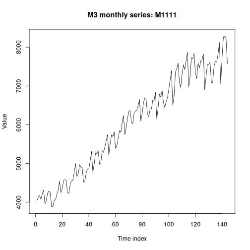

This notebook demonstrates loading and visualizing time series from the third Makridakis forecasting competition (M3).
We select a monthly series and build a simple ARIMA forecast.

Source: https://www.sciencedirect.com/science/article/abs/pii/S0169207000000571

## Setup


``` r
# Load required packages
library(tspredbench)
library(daltoolbox)
library(harbinger)
library(tspredit)
```

## Load M3 dataset


``` r
data(m3)
head(m3$monthly, 5)
```

```
## $M1
##   [1] 2640 2640 2160 4200 3360 2400 3600 1920 4200 4560  480 3720 5640 2880 1800 3120 2400 2520 9000 2640 3120 2880 8760
##  [24] 5160 2160 8280 4920 3120 6600 4080 5880 1680 6720 2040 6480 1920 3600 2040 2760 3840  960 2280 1320 2160 4800 3000
##  [47] 3120 5880 2640 2400 2280  480 5040 1920  840 2520 1560 1440  240 1800 4680 1800 1680 3720 2160  480 2040 1440   NA
##  [70]   NA   NA   NA   NA   NA   NA   NA   NA   NA   NA   NA   NA   NA   NA   NA   NA   NA   NA   NA   NA   NA   NA   NA
##  [93]   NA   NA   NA   NA   NA   NA   NA   NA   NA   NA   NA   NA   NA   NA   NA   NA   NA   NA   NA   NA   NA   NA   NA
## [116]   NA   NA   NA   NA   NA   NA   NA   NA   NA   NA   NA   NA   NA   NA   NA   NA   NA   NA   NA   NA   NA   NA   NA
## [139]   NA   NA   NA   NA   NA   NA
## 
## $M160
##   [1] 2800 1200 2500 2800 3050 3050 2500 3950 3750 4650 3850 2250 2750 3950 3050 3750 3600 4900 5350 4450 4250 4050 5100
##  [24] 3900 5300 4700 4250 5900 5650 5350 5350 5000 4750 6900 5350 7550 5600 4800 6600 5650 4600 6300 5700 6500 7600 4750
##  [47] 4900 7500 6000 5800 7800 6750 5950 8400 5150 9000 8050 6250 8000 6100 6300 5700 5950 5900 7700 8250 6650 7500 5800
##  [70]   NA   NA   NA   NA   NA   NA   NA   NA   NA   NA   NA   NA   NA   NA   NA   NA   NA   NA   NA   NA   NA   NA   NA
##  [93]   NA   NA   NA   NA   NA   NA   NA   NA   NA   NA   NA   NA   NA   NA   NA   NA   NA   NA   NA   NA   NA   NA   NA
## [116]   NA   NA   NA   NA   NA   NA   NA   NA   NA   NA   NA   NA   NA   NA   NA   NA   NA   NA   NA   NA   NA   NA   NA
## [139]   NA   NA   NA   NA   NA   NA
## 
## $M318
##   [1] 3320 3240 3120 3660 4540 3420 3300 4160 4480 3980 4020 3860 3180 3120 4260 3220 3640 4820 3560 4380 4560 4100 3860
##  [24] 3500 3780 3460 2980 3040 3180 5000 3720 3760 4260 4540 4520 3720 3280 3120 3300 3200 3460 3440 4000 4100 4180 4620
##  [47] 4700 3720 3380 3160 3700 3380 3220 4800 3660 3600 4620 4220 4020 3560 3580 3240 3160 3340 3420 3580 3880 4800 3860
##  [70] 4560 4160 3200 3400 3340 3000 3080 3180 3680 4400 3640 4620 3880 3760 3320 3160 3000 3140 3340 3140 4260 3360 3740
##  [93] 4460 4500 3740 3680 3220 3120 3100 3100 3040 3340 3560 3840 4240 4260 4560 3520 3220 3480 3020 3240 2980 3260 3360
## [116] 3160 4800 5000 3760 3260 3060 3040 2840 3180 2960 3700   NA   NA   NA   NA   NA   NA   NA   NA   NA   NA   NA   NA
## [139]   NA   NA   NA   NA   NA   NA
## 
## $M477
##   [1] 5379.2 5338.0 5977.0 5585.6 5594.2 5590.6 5458.8 4778.8 3979.2 3950.0 4659.4 5552.0 5847.0 5590.0 6060.4 5997.8 6238.8
##  [18] 6138.4 5622.6 5165.6 4342.4 4149.4 4935.6 6338.2 5947.4 5580.0 6087.0 5994.0 6362.8 5754.6 5499.0 5027.4 4182.2 4177.4
##  [35] 4451.8 5166.8 5508.6 5180.4 4928.0 4880.6 5284.2 4767.8 4258.6 3996.2 3753.4 4009.6 4590.8 5071.8 4275.4 4644.4 5693.0
##  [52] 5504.6 5441.0 5244.6 4814.4 4237.8 4222.8 4267.0 4630.6 5193.0 5082.4 4245.2 4649.6 4405.0 4840.4 4172.6 4039.0 3689.2
##  [69] 3636.0 3591.0 3371.4 4217.4 4406.2 3821.0 3902.8 3820.8 4247.6 3766.6 3380.8 3289.4 3254.0 3022.4 3693.2 3982.6 4186.0
##  [86] 3724.0 4528.4 4815.4 5609.8 5176.2 4534.0 4037.4 3783.8 4015.2 4237.2 4364.6 4682.4 4830.2 5608.4 5077.4 5400.2 5524.2
## [103] 4731.6 4209.6 3394.2 3721.0 3998.6 4790.4 5135.2 4383.0 5164.0 5137.4 5690.8 5166.0 4850.0 4349.4 3685.6 3507.6 3659.8
## [120] 4374.6 4300.4 3593.2 4313.2 3890.8 4457.0 4539.6 3942.2 3612.4 3367.6 3275.0 3858.8 4761.6 4894.8 3948.6 4716.6 5034.2
## [137] 5864.6 5321.2 4715.0 3937.0 3417.8     NA     NA     NA
## 
## $M635
##   [1] 1920 2000 2120 2020 1880 1980 2280 2900 3060 3280 3060 2900 3140 3700 3740 3880 3460 3300 3000 3320 3360 3300 3060
##  [24] 2800 3220 2800 2640 1700 1860 2420 2340 2060 2220 2440 2220 2120 2360 2320 2300 2060 1980 2340 2820 2980 2820 2640
##  [47] 2580 2480 2500 2160 2540 2320 2300 2480 2740 2960 3060 3000 3060 3320 3400 3720 3640 3540 3760 3940 3700 3560 3600
##  [70] 3460 3000 4160 3660 3580 4060 3540 3680 4040 3800 4300 4740 4200 3900 4200 3780 3940 3700 2800 3400 3440 3500 3940
##  [93] 4520 4440 4260 4300 4680 4580 4780 4760 4980 5480 5600 6160 5900 5660 4900 4500 5100 6640 6340 4520 4580 5140 5480
## [116] 5260 6320 7000 3220 3340 3400 3180 3000 3620 3920 3920 3420 3540 4440 4580 4020 4120 4240   NA   NA   NA   NA   NA
## [139]   NA   NA   NA   NA   NA   NA
```

## Select and prepare a series


``` r
series <- m3$monthly$M1111
values <- as.numeric(series)
time <- seq_along(values)
```

## Visualize the series


``` r
plot(time, values, type = "l",
     main = "M3 monthly series: M1111",
     ylab = "Value", xlab = "Time index")
```



## Train/test split and supervised projection


``` r
ts <- ts_data(values, sw = 1)
samp <- ts_sample(ts, test_size = 5)
io_train <- ts_projection(samp$train)
io_test  <- ts_projection(samp$test)
```

## Fit ARIMA model


``` r
model <- ts_arima()
model <- fit(model, x = io_train$input, y = io_train$output)
```

## Forecast and evaluate


``` r
prediction <- predict(model, x = io_test$input[1, ], steps_ahead = 5)
pred <- as.vector(prediction)
real <- as.vector(io_test$output)
ev_test <- evaluate(model, real, pred)
ev_test
```

```
## $values
## [1] 7725 8265 8285 8220 7580
## 
## $prediction
## [1] 7144.005 7692.897 7712.865 7734.475 7757.109
## 
## $smape
## [1] 0.06106715
## 
## $mse
## [1] 251859.5
## 
## $R2
## [1] -1.793783
## 
## $metrics
##        mse      smape        R2
## 1 251859.5 0.06106715 -1.793783
```

## References

- Makridakis, S., & Hibon, M. (2000). The M3-Competition: results, conclusions and implications. International Journal of Forecasting.
