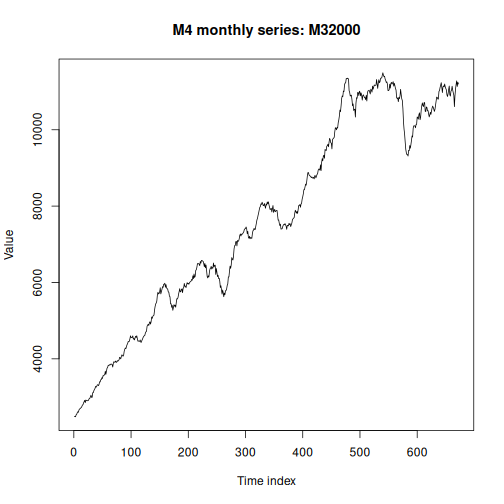

This notebook demonstrates loading and visualizing time series from the fourth Makridakis forecasting competition (M4).
We select a monthly series and build a simple ARIMA forecast.

Source: https://github.com/Mcompetitions/M4-methods

## Setup


``` r
# Load required packages
library(tspredbench)
library(daltoolbox)
library(harbinger)
library(tspredit)
```

## Load M4 dataset


``` r
data(m4)
head(m4$monthly$M32000, 5)
```

```
## [1] 2488.589 2491.095 2481.444 2533.483 2546.280
```

## Select and prepare a series


``` r
series <- m4$monthly$M32000
values <- as.numeric(series)
values <- na.omit(values)
time <- seq_along(values)
```

## Visualize the series


``` r
plot(time, values, type = "l",
     main = "M4 monthly series: M32000",
     ylab = "Value", xlab = "Time index")
```



## Train/test split and supervised projection


``` r
ts <- ts_data(values, sw = 1)
samp <- ts_sample(ts, test_size = 5)
io_train <- ts_projection(samp$train)
io_test  <- ts_projection(samp$test)
```

## Fit ARIMA model


``` r
model <- ts_arima()
model <- fit(model, x = io_train$input, y = io_train$output)
```

## Forecast and evaluate


``` r
prediction <- predict(model, x = io_test$input[1, ], steps_ahead = 5)
pred <- as.vector(prediction)
real <- as.vector(io_test$output)
ev_test <- evaluate(model, real, pred)
ev_test
```

```
## $values
## [1] 11188.67 11280.36 11134.74 11246.02 11198.87
## 
## $prediction
## [1] 11021.77 11114.89 11163.65 11166.74 11202.32
## 
## $smape
## [1] 0.00795626
## 
## $mse
## [1] 12473.68
## 
## $R2
## [1] -3.993255
## 
## $metrics
##        mse      smape        R2
## 1 12473.68 0.00795626 -3.993255
```

## References

- Makridakis, S., Spiliotis, E., & Assimakopoulos, V. (2020). The M4 Competition: Results, findings, conclusion and way forward. International Journal of Forecasting.
