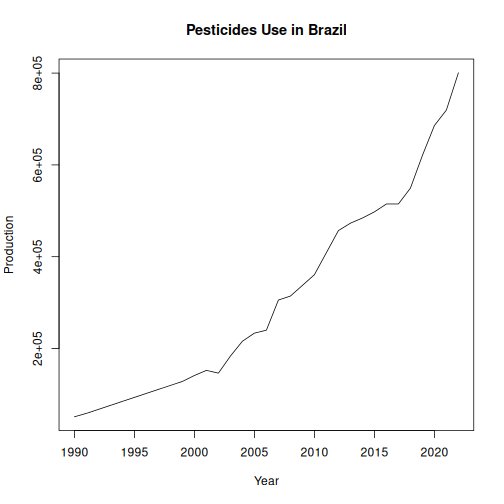

Statistics on the use of major pesticide groups and relevant chemical families.

Source: http://www.fao.org/faostat/en/#data/RP

##Load series


``` r
library(dalts)
library(daltoolbox)
library(harbinger)
library(tspredit)

## Load series ----------------------
data(pesticides)
head(pesticides,5)
```

```
## $india_pest
##     1990     1991     1992     1993     1994     1995     1996     1997     1998     1999     2000     2001     2002     2003 
## 75000.00 72133.00 70791.00 66074.00 61357.00 61257.00 56114.00 52279.00 49157.00 46195.00 44957.52 43720.04 42482.56 41245.08 
##     2004     2005     2006     2007     2008     2009     2010     2011     2012     2013     2014     2015     2016     2017 
## 35113.00 35342.00 37423.00 27422.77 14485.33 28707.01 40093.69 40093.69 40093.69 40093.69 40093.69 40093.69 40093.69 40093.69 
##     2018     2019     2020     2021     2022 
## 40093.69 40093.69 40093.69 40093.69 40093.69 
## 
## $japan_pest
##     1990     1991     1992     1993     1994     1995     1996     1997     1998     1999     2000     2001     2002     2003 
## 79821.18 79821.18 79821.18 79821.18 79821.18 79821.18 79821.18 79821.18 79821.18 79821.18 79821.18 78735.45 70262.54 67869.72 
##     2004     2005     2006     2007     2008     2009     2010     2011     2012     2013     2014     2015     2016     2017 
## 64688.88 63829.77 65248.26 61164.07 58750.00 60970.80 55576.00 51796.30 54716.40 52794.30 53543.70 54171.16 51006.00 52248.00 
##     2018     2019     2020     2021     2022 
## 52332.00 51970.00 48889.00 48783.00 50320.00 
## 
## $canada_pest
##     1990     1991     1992     1993     1994     1995     1996     1997     1998     1999     2000     2001     2002     2003 
## 29568.00 29477.50 29387.00 29296.50 29206.00 32234.97 35263.94 38292.91 41321.89 44350.86 39718.43 38501.00 34264.57 35628.14 
##     2004     2005     2006     2007     2008     2009     2010     2011     2012     2013     2014     2015     2016     2017 
## 36163.71 36382.29 36585.61 45146.45 53707.30 54529.40 61050.00 62107.20 73508.90 81659.80 76314.00 75318.30 90926.00 98304.00 
##     2018     2019     2020     2021     2022 
## 87632.00 78893.00 92960.00 97692.00 97692.00 
## 
## $usa_pest
##     1990     1991     1992     1993     1994     1995     1996     1997     1998     1999     2000     2001     2002     2003 
## 400522.3 395079.0 401883.1 390543.1 425922.7 423201.5 433180.4 431819.2 424562.1 433634.0 430005.2 411407.9 413313.0 407053.5 
##     2004     2005     2006     2007     2008     2009     2010     2011     2012     2013     2014     2015     2016     2017 
## 418030.4 409730.0 392810.7 400068.2 379202.9 358337.7 374818.2 391298.7 407779.2 418673.9 413134.8 423474.9 451666.8 449713.0 
##     2018     2019     2020     2021     2022 
## 457385.4 495672.7 474707.5 433770.9 467676.6 
## 
## $china_pest
##     1990     1991     1992     1993     1994     1995     1996     1997     1998     1999     2000     2001     2002     2003 
## 154626.5 154600.9 160987.9 169583.2 194845.2 215277.0 225428.1 235141.7 241540.6 261009.2 250631.6 249212.9 258217.8 260473.6 
##     2004     2005     2006     2007     2008     2009     2010     2011     2012     2013     2014     2015     2016     2017 
## 271521.0 284981.4 299316.3 315919.8 324563.9 331298.5 339849.8 345719.3 350468.6 351036.7 349220.0 346087.2 338311.7 323252.8 
##     2018     2019     2020     2021     2022 
## 294682.5 273569.5 258757.9 244869.5 235760.4
```


``` r
serie <- pesticides$brazil_pest
serie
```

```
##      1990      1991      1992      1993      1994      1995      1996      1997      1998      1999      2000      2001 
##  51119.88  58662.11  67357.56  76053.01  84748.45  93443.92 102139.37 110834.81 119530.27 128225.71 141129.91 152270.63 
##      2002      2003      2004      2005      2006      2007      2008      2009      2010      2011      2012      2013 
## 146264.45 183340.48 215779.40 233366.94 239892.01 305530.23 314190.53 337391.08 360735.33 408787.30 456839.26 472977.15 
##      2014      2015      2016      2017      2018      2019      2020      2021      2022 
## 484254.38 497625.68 514828.96 514843.00 549280.00 620538.00 685746.00 719507.00 800652.17
```


``` r
years <- as.numeric(names(serie))
values <- as.numeric(serie)
plot(years, values, type = "l", main = "Pesticides Use in Brazil", ylab = "Production", xlab = "Year")
```



``` r
# Create object ts_data with horizon = 1
ts <- ts_data(values, sw = 1)

# Separate Training and Test samples
samp <- ts_sample(ts, test_size = 5)

#  Input/output projection
io_train <- ts_projection(samp$train)
io_test <- ts_projection(samp$test)
```


``` r
# Create ARIMA and train
model <- ts_arima()
model <- fit(model, x = io_train$input, y = io_train$output)
```


``` r
# Predicting next 5 years
prediction <- predict(model, x = io_test$input[1,], steps_ahead = 5)

# Converting to vector
pred <- as.vector(prediction)
real <- as.vector(io_test$output)

# Evaluate
ev_test <- evaluate(model, real, pred)
ev_test
```

```
## $values
## [1] 549280.0 620538.0 685746.0 719507.0 800652.2
## 
## $prediction
## [1] 532017.9 549192.9 566367.8 583542.7 600717.7
## 
## $smape
## [1] 0.1677249
## 
## $mse
## [1] 15619872256
## 
## $R2
## [1] -1.130583
## 
## $metrics
##           mse     smape        R2
## 1 15619872256 0.1677249 -1.130583
```

