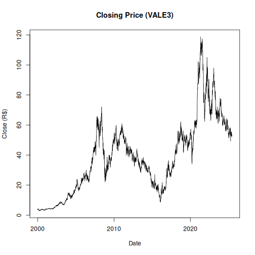

This notebook demonstrates how to load, visualize, and forecast closing prices for a selected IBX‑50 ticker
from the `stocks` dataset using a simple ARIMA model.

Source: https://www.b3.com.br

## Setup


``` r
# Load required packages
library(tspredbench)
library(daltoolbox)
library(harbinger)
library(tspredit)
```

## Load stocks dataset


``` r
# Load the stocks list object and inspect a known ticker (if present)
data(stocks)
if ("VALE3" %in% names(stocks)) head(stocks$VALE3, 5) else head(stocks[[1]], 5)
```

```
##         date     open     high      low    close  volume
## 1 2000-01-03 3.500000 3.542500 3.500000 3.500000  585600
## 2 2000-01-04 3.466666 3.474166 3.416666 3.416666  782400
## 3 2000-01-05 3.375000 3.416666 3.375000 3.416666 1876800
## 4 2000-01-06 3.416666 3.500000 3.416666 3.416666  792000
## 5 2000-01-07 3.458333 3.559166 3.458333 3.541666 5347200
```

## Select a ticker series


``` r
# Prefer VALE3 if available, otherwise pick the first ticker
if ("VALE3" %in% names(stocks)) {
  series_df <- stocks$VALE3
  ticker <- "VALE3"
} else {
  ticker <- names(stocks)[1]
  series_df <- stocks[[1]]
}
head(series_df, 5)
```

```
##         date     open     high      low    close  volume
## 1 2000-01-03 3.500000 3.542500 3.500000 3.500000  585600
## 2 2000-01-04 3.466666 3.474166 3.416666 3.416666  782400
## 3 2000-01-05 3.375000 3.416666 3.375000 3.416666 1876800
## 4 2000-01-06 3.416666 3.500000 3.416666 3.416666  792000
## 5 2000-01-07 3.458333 3.559166 3.458333 3.541666 5347200
```

## Visualize the closing price


``` r
years <- series_df$date
values <- series_df$close
plot(years, values, type = "l",
     main = paste0("Closing Price (", ticker, ")"),
     ylab = "Close (R$)", xlab = "Date")
```



## Train/test split and supervised projection


``` r
ts <- ts_data(values, sw = 1)
samp <- ts_sample(ts, test_size = 5)
io_train <- ts_projection(samp$train)
io_test  <- ts_projection(samp$test)
```

## Fit ARIMA model


``` r
model <- ts_arima()
model <- fit(model, x = io_train$input, y = io_train$output)
```

## Forecast and evaluate


``` r
prediction <- predict(model, x = io_test$input[1, ], steps_ahead = 5)
pred <- as.vector(prediction)
real <- as.vector(io_test$output)
ev_test <- evaluate(model, real, pred)
ev_test
```

```
## $values
## [1] 52.77 52.91 52.98 53.29 53.65
## 
## $prediction
## [1] 52.55429 52.57377 52.58861 52.60064 52.61095
## 
## $smape
## [1] 0.0100926
## 
## $mse
## [1] 0.3735248
## 
## $R2
## [1] -2.765358
## 
## $metrics
##         mse     smape        R2
## 1 0.3735248 0.0100926 -2.765358
```

## References

- Box, G. E. P., Jenkins, G. M., Reinsel, G. C., & Ljung, G. M. (2015). Time Series Analysis: Forecasting and Control.
