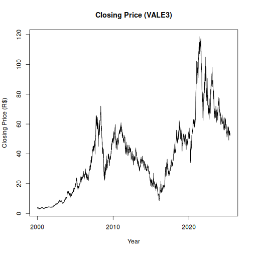

Historical daily data for the 50 most traded stocks in B3 (IBOVESPA), including opening, high, low, and closing prices, as well as trading volume.

Source: https://www.b3.com.br

##Load series


``` r
library(dalts)
library(daltoolbox)
library(harbinger)
library(tspredit)

## Load series ----------------------
data(stocks)
head(stocks$VALE3,5)
```

```
##         date     open     high      low    close  volume
## 1 2000-01-03 3.500000 3.542500 3.500000 3.500000  585600
## 2 2000-01-04 3.466666 3.474166 3.416666 3.416666  782400
## 3 2000-01-05 3.375000 3.416666 3.375000 3.416666 1876800
## 4 2000-01-06 3.416666 3.500000 3.416666 3.416666  792000
## 5 2000-01-07 3.458333 3.559166 3.458333 3.541666 5347200
```


``` r
serie <- stocks$VALE3
head(serie,5)
```

```
##         date     open     high      low    close  volume
## 1 2000-01-03 3.500000 3.542500 3.500000 3.500000  585600
## 2 2000-01-04 3.466666 3.474166 3.416666 3.416666  782400
## 3 2000-01-05 3.375000 3.416666 3.375000 3.416666 1876800
## 4 2000-01-06 3.416666 3.500000 3.416666 3.416666  792000
## 5 2000-01-07 3.458333 3.559166 3.458333 3.541666 5347200
```


``` r
years <- serie$date
values <- serie$close
plot(years, values, type = "l", main = "Closing Price (VALE3)", ylab = "Closing Price (R$)", xlab = "Year")
```




``` r
# Create object ts_data with horizon = 1
ts <- ts_data(values, sw = 1)

# Separate Training and Test samples
samp <- ts_sample(ts, test_size = 5)

#  Input/output projection
io_train <- ts_projection(samp$train)
io_test <- ts_projection(samp$test)
```


``` r
# Create ARIMA and train
model <- ts_arima()
model <- fit(model, x = io_train$input, y = io_train$output)
```


``` r
# Predicting next 5 years
prediction <- predict(model, x = io_test$input[1,], steps_ahead = 5)

# Converting to vector
pred <- as.vector(prediction)
real <- as.vector(io_test$output)

# Evaluate
ev_test <- evaluate(model, real, pred)
ev_test
```

```
## $values
## [1] 52.77 52.91 52.98 53.29 53.65
## 
## $prediction
## [1] 52.55429 52.57377 52.58861 52.60064 52.61095
## 
## $smape
## [1] 0.0100926
## 
## $mse
## [1] 0.3735248
## 
## $R2
## [1] -2.765358
## 
## $metrics
##         mse     smape        R2
## 1 0.3735248 0.0100926 -2.765358
```

